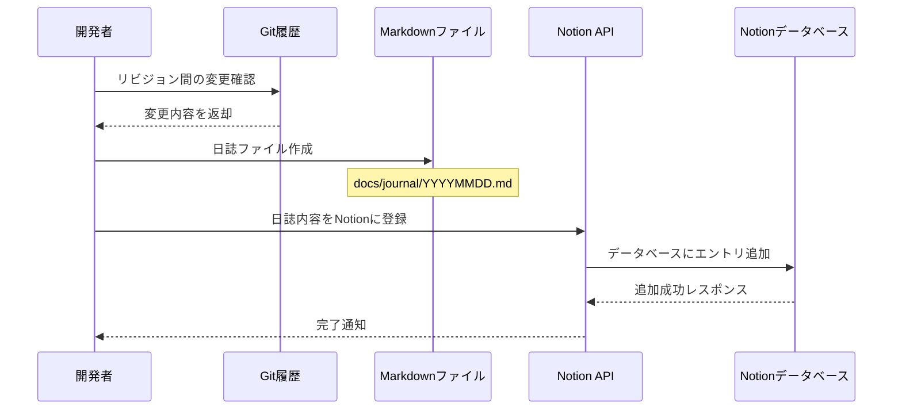

# GitHub Copilot プロジェクト指示書

## 開発日誌作成・管理フロー

### プロセス概要図

以下のシーケンス図は、Git履歴から日誌を作成し、Notionに登録するまでの流れを示しています。



### 1. 日誌ファイルの作成

開発日誌は以下の形式でMarkdownファイルとして作成します：

```markdown
# 開発日誌

## 日付: 2025年5月31日

## 変更概要
[簡潔な変更の概要]

## 作業内容の詳細

### [カテゴリ1]
- [詳細な作業内容]
- [バグ修正内容]

### [カテゴリ2]
- [詳細な作業内容]

## 今後の改善点
- [改善点1]
- [改善点2]

## レビュー状況
- [レビュー状況の記述]
```

日誌ファイルは `docs/journal/YYYYMMDD.md` の形式で保存します。

### 2. Notionへの登録フロー

開発日誌はNotionデータベースにも登録します。以下の手順でMCP Server notionAPIを使用して登録します：

- Notion APIを使用して、データベース一覧を取得してIDを確認 `API-retrieve-a-database`
- Notion APIを使用して、日誌内容をJSON形式でデータベースに登録

### 3. Git履歴からの日誌作成

特定のリビジョン間の変更を日誌にまとめる際は以下のコマンドを使用します：

```bash
# リビジョン間の変更を取得
git log [開始リビジョン]..[終了リビジョン] --oneline

# 特定ファイルの変更詳細を確認
git diff [開始リビジョン]..[終了リビジョン] -- [ファイルパス]
```

## GitHub Issue管理フロー

### GitHub Issueの取得と追跡

プロジェクトのGitHub Issueを取得・管理するためのフローです。


### 1. GitHub Issueの取得

GitHub Issueを取得するには、MCP Server （GitHub API）の `search_repositories` 機能を使用します。

### 2. コマンドラインからのIssue取得

GitHub CLIを使用すると、コマンドラインから直接Issueを取得できます：

```bash
# 全Issueのリスト取得
gh issue list

# 特定のIssueの詳細取得
gh issue view ISSUE_NUMBER

# 新しいIssueの作成
gh issue create --title "Issue Title" --body "Issue description"
```

### 3. 日誌とIssueの関連付け

開発日誌にIssue番号を記録することで、作業内容とIssueを関連付けます：

```markdown
# 開発日誌: 2025年5月31日

## 関連Issue
- #42: 給与計算機能のバグ修正
- #56: ユニットテスト追加

## 作業内容の詳細
...
```

## Copilotへの具体的な指示

### 日誌作成支援時

1. 変更内容を適切なカテゴリに分類して提案する
2. 重要な変更点を簡潔に要約する
3. 変更がコード品質にどのような影響を与えるかを分析する
4. Notionへの登録用のJSONデータ構造を提案する

## プロジェクト構造

```
app/
  payroll/         # 給与計算システム
    src/
      payroll/
        core.clj   # 給与計算の主要ロジック
    spec/
      payroll/
        core_spec.clj  # テストケース
  bowlinggame/     # ボウリングゲームスコア計算
  gossipingBusDrivers/ # バスドライバーのゴシッププロブレム
  hello-world/     # Hello World サンプル
  primefactors/    # 素因数分解
docs/
  journal/         # 開発日誌保存ディレクトリ
    YYYYMMDD.md    # 日付形式の日誌ファイル
```

