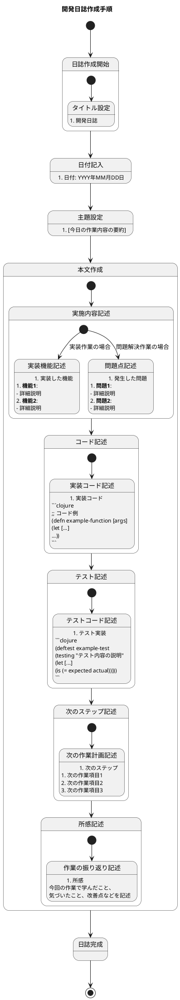

# Project Guidelines

## 日誌作成手順のステートチャート

以下は、開発日誌を作成する手順をPlantUMLステートチャートで表現したものです。



このステートチャートは、開発日誌を作成する手順を表しています。主な作成ステップは以下の通りです：

1. 日誌作成開始
   - タイトル「開発日誌」を設定
2. 日付記入
   - 「日付: YYYY年MM月DD日」の形式で記入
3. 主題設定
   - その日の作業内容を要約したタイトルを設定
4. 本文作成
   - 実施内容記述（実装機能または問題点）
   - 実装コードの記述
   - テスト実装の記述
   - 次のステップの記述
   - 所感（振り返り）の記述
5. 日誌完成

各状態は日誌作成の各段階を表し、状態間の遷移は作成プロセスの流れを示しています。

## 日誌のフォーマット

以下は、開発日誌の一般的なフォーマットです。このテンプレートを使用して、日々の開発作業を記録してください。

```markdown
# 開発日誌

## 日付: YYYY年MM月DD日

### [作業内容の要約タイトル]

今日は[プロジェクト名]の[主な作業内容]を行いました。主に[具体的な取り組み内容]に取り組みました。

#### 実装した機能

1. **[機能カテゴリ1]**:
   - [詳細説明1]
   - [詳細説明2]
   - [詳細説明3]

2. **[機能カテゴリ2]**:
   - [詳細説明1]
   - [詳細説明2]

3. **[機能カテゴリ3]**:
   - [詳細説明1]
   - [詳細説明2]
   - [詳細説明3]

4. **[その他の作業]**:
   - [詳細説明1]
   - [詳細説明2]

#### 実装コード

\```clojure
;; [コードの説明]
(defn example-function [args]
  (let [local-vars (process args)]
    ;; 処理内容
    (some-operation local-vars)))

;; [別のコードの説明]
(defn another-function [params]
  ;; 処理内容
  (calculate-something params))
\```

#### テスト実装

\```clojure
;; [テストの説明]
(deftest feature-test
  (testing "[テスト内容の説明]"
    (let [test-data (setup-test-data)]
      ;; テスト実行
      (is (= expected-result (function-under-test test-data))))))

;; [別のテストの説明]
(deftest another-test
  (testing "[テスト内容の説明]"
    ;; テストケース1
    (let [case1 (setup-case1)]
      (is (predicate? (function-under-test case1))))
    ;; テストケース2
    (let [case2 (setup-case2)]
      (is (= expected-result (function-under-test case2))))))
\```

#### 次のステップ

1. [次の作業項目1]
2. [次の作業項目2]
3. [次の作業項目3]
4. [次の作業項目4]

#### 所感

今回の実装では、[開発アプローチ]のアプローチを取りながら、[プロジェクト名]の[どのような機能]を[どのように]しました。特に、[特筆すべき点]について[どのような効果があったか]。

[コードの改善点]により、[どのような利点]が得られました。特に、[具体的な例]によって[どのような効果]がありました。

また、[その他の成果]によって、今後の[将来の展望]において[どのような利点]が期待できます。次のステップとしては、[次回の主な作業内容]に取り組む予定です。
```

