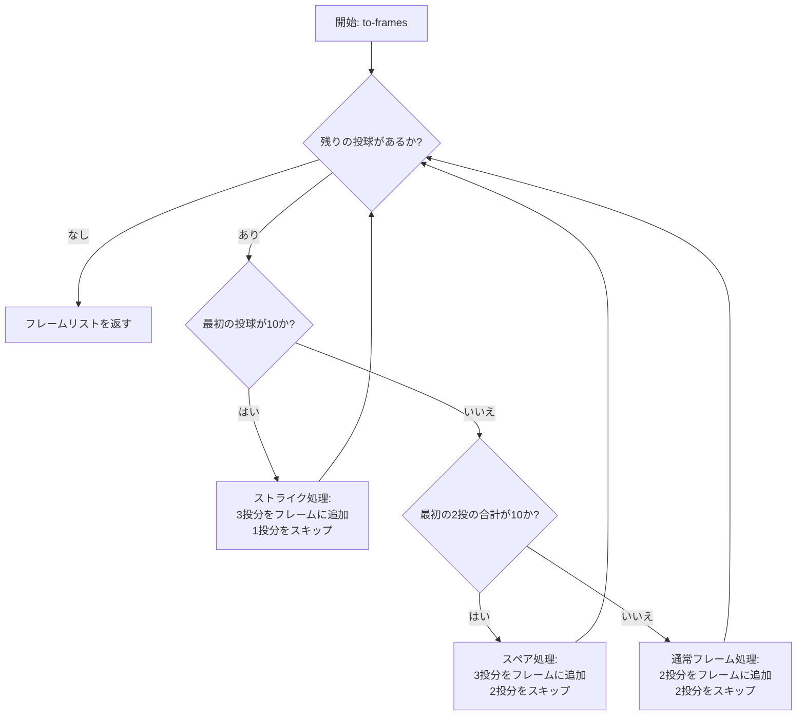
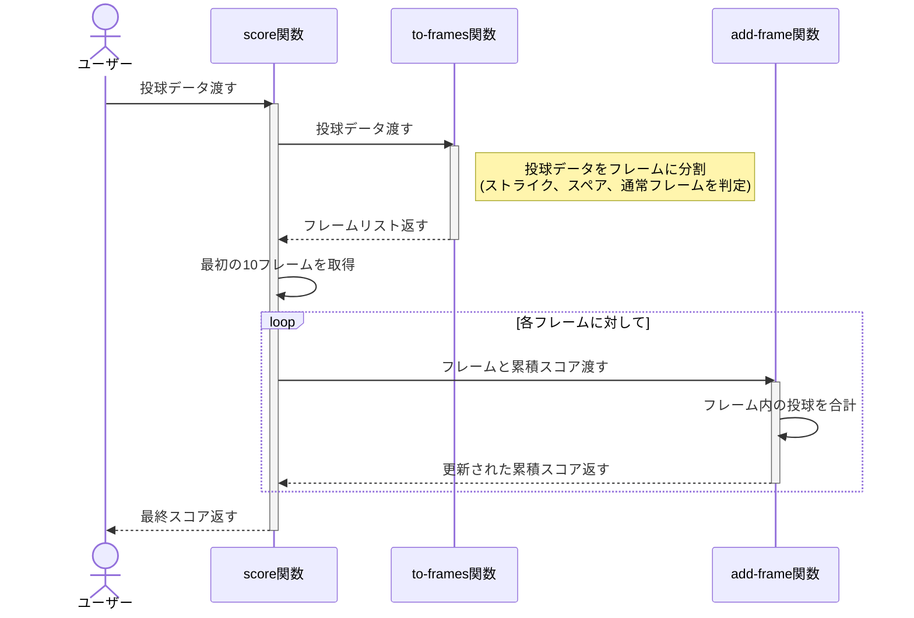
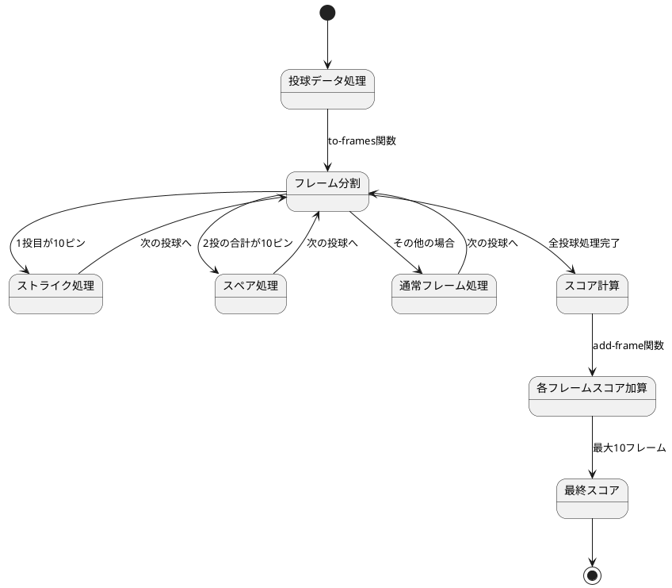
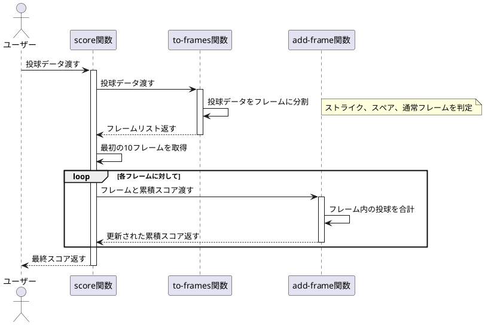

# ボウリングゲーム

ボウリングゲームのスコア計算機のClojure実装です。このプロジェクトは、Clojureにおける関数型プログラミングの原則とテスト駆動開発を示しています。

## 概要

このアプリケーションは、標準的な10ピンボウリングゲームのスコア計算ルールを実装しています。この実装は以下を処理します：

- 基本的なスコアリング
- スペア（2投で10ピンすべてを倒す）
- ストライク（1投で10ピンすべてを倒す）
- 10フレーム目のボーナス投球

## インストール

[Clojure](https://clojure.org/guides/getting_started)とClojure CLIツールがインストールされていることを確認してください。

このリポジトリをクローンし、プロジェクトディレクトリに移動します：

```bash
git clone <repository-url>
cd bowlinggame
```

## 使用方法

コア機能は`bowlinggame.core`名前空間によって提供されています。使用方法は以下の通りです：

```clojure
(require '[bowlinggame.core :refer :all])

;; 投球データを用意
(def rolls [10 7 2 8 1 9 0 10 10 10 9 1 8 0 7 3 9 1 10])

;; スコアを計算
(score rolls)
```

## テストの実行

このプロジェクトはテスト用に[speclj](https://github.com/slagyr/speclj)を使用しています。テストを実行するには：

```bash
clojure -M:spec
```

このプロジェクトはClojureの組み込みテストフレームワークもサポートしています：

```bash
clojure -M:test
```

## 実装の詳細

この実装は関数型アプローチに従っています：

- `to-frames`: 投球データをフレームに分割します。ストライク、スペア、通常フレームを判定し、適切に処理します
- `add-frame`: フレームのスコアを計算し、累積スコアに加算します
- `score`: 投球データを受け取り、`to-frames`と`add-frame`を使用して最終スコアを計算します

## ボウリングのスコアリングルール

ボウリングでは：
- ゲームは10フレームで構成されています
- 各フレームで、プレイヤーは10ピンを倒す2回のチャンスがあります
- フレームのスコアは、倒れたピンの合計数に、ストライクとスペアのボーナスを加えたものです
- スペアは、プレイヤーが2回の試行で10ピンすべてを倒した場合です。ボーナスは次の投球の値です
- ストライクは、プレイヤーが最初の試行で10ピンすべてを倒した場合です。ボーナスは次の2回の投球の値です
- 10フレーム目では、スペアまたはストライクを投げたプレイヤーは、フレームを完了するために追加の球を投げることが許可されます（最大3投まで）

### スコアリング例

以下の表は、異なるシナリオでのスコア計算方法を示しています：

| シナリオ | 投球 | 計算方法 | スコア |
|---------|------|---------|-------|
| 通常フレーム | 3, 5 | 3 + 5 = 8 | 8 |
| スペア | 7, 3, 次の投球: 4 | 7 + 3 + 4(ボーナス) = 14 | 14 |
| ストライク | 10, 次の2投: 8, 1 | 10 + 8 + 1(ボーナス) = 19 | 19 |
| 連続ストライク | 10, 10, 10 | 10 + 10 + 10(ボーナス) = 30 | 30 |
| パーフェクトゲーム | 12回連続ストライク | 10 + (10 + 10) × 9 + 10 + 10 = 300 | 300 |
| ガターゲーム | すべて0 | 0 × 20 = 0 | 0 |

## アルゴリズムの詳細

本実装では、ボウリングスコアの計算に再帰的なアプローチを採用しています。主要な処理は`to-frames`関数と`add-frame`関数によって行われます。

### フローチャート（Mermaid）



### シーケンス図（Mermaid）



### ステートチャート（PlantUML）



### シーケンス図（PlantUML）



### `to-frames`関数の処理

```clojure
(defn to-frames [rolls]
  (loop [remaining-rolls rolls frames []]
    (cond
      (empty? remaining-rolls) frames
      (= 10 (first remaining-rolls)) ...
      (= 10 (reduce + (take 2 remaining-rolls))) ...
      :else ...)))
```

この関数は投球データを処理して、フレームのリストを作成します。

#### 初期化
```clojure
(loop [remaining-rolls rolls frames []]
  ...)
```

- `remaining-rolls`: 処理すべき投球データ全体を初期値として設定
- `frames`: 空の配列から開始して、処理されたフレームを格納

#### 条件分岐による処理

1. **ストライクの場合** (`(= 10 (first remaining-rolls))`)
   ```clojure
   (recur (rest remaining-rolls)
          (conj frames (take 3 remaining-rolls)))
   ```
    - 1投目が10ピンの場合はストライク
    - 次の2投をボーナスとして含めた3投分をフレームとして追加
    - 次のループでは1投分だけスキップ

   例: `[10, 3, 4, 7, 2]`
    - 最初のフレーム: `[10, 3, 4]` (ストライク + ボーナス2投)
    - 次の処理対象: `[3, 4, 7, 2]`

2. **スペアの場合** (`(= 10 (reduce + (take 2 remaining-rolls)))`)
   ```clojure
   (recur (drop 2 remaining-rolls)
          (conj frames (take 3 remaining-rolls)))
   ```
    - 最初の2投の合計が10ピンの場合はスペア
    - 次の1投をボーナスとして含めた3投分をフレームとして追加
    - 次のループでは2投分をスキップ

   例: `[6, 4, 5, 3, 7, 2]`
    - 最初のフレーム: `[6, 4, 5]` (スペア + ボーナス1投)
    - 次の処理対象: `[5, 3, 7, 2]`

3. **通常フレームの場合** (`:else`)
   ```clojure
   (recur (drop 2 remaining-rolls)
          (conj frames (take 2 remaining-rolls)))
   ```
    - 通常のフレームでは2投分をそのままフレームとして追加
    - 次のループでは2投分をスキップ

   例: `[5, 3, 7, 2]`
    - 最初のフレーム: `[5, 3]` (通常フレーム)
    - 次の処理対象: `[7, 2]`

### `add-frame`関数の処理

```clojure
(defn add-frame [score frame]
  (+ score (reduce + frame)))
```

この関数は各フレームのスコアを計算し、累積スコアに加算します：

- `score`: 現在までの累積スコア
- `frame`: 計算対象のフレーム（通常2投、ボーナスがある場合3投）
- フレーム内の全ての投球を合計して、それを累積スコアに加算

### 最終スコア計算

```clojure
(defn score [rolls]
  (reduce add-frame 0 (take 10 (to-frames rolls))))
```

- `to-frames`でフレームのリストを作成
- 最大10フレームに制限
- 各フレームのスコアを合計して最終スコアを計算


## ライセンス

このプロジェクトは[MITライセンス](LICENSE)の下で利用可能です。
