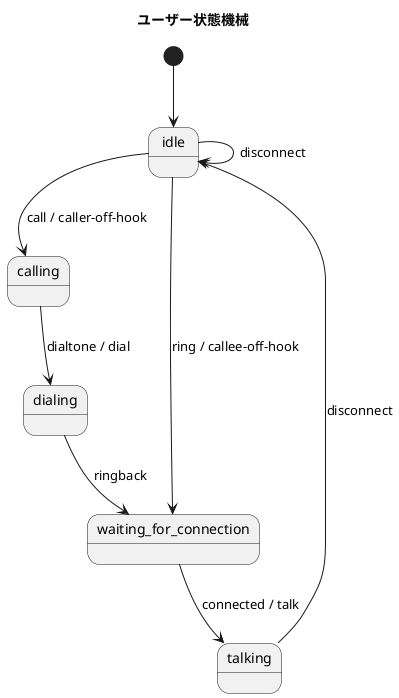
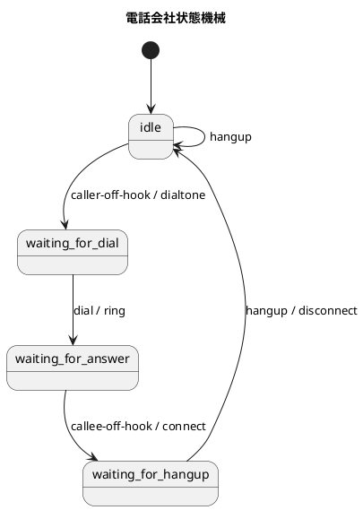
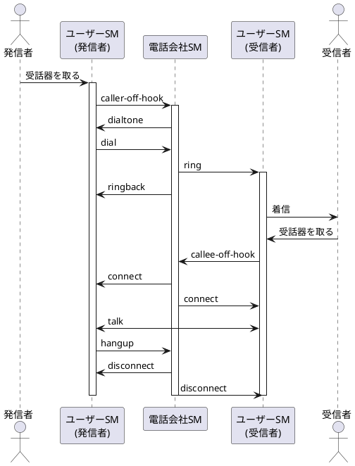

# 並行処理シミュレーション

このモジュールは、Clojureのエージェントと状態機械を使用して電話システムをシミュレーションする並行処理の実装です。このプロジェクトは、Clojureにおける並行プログラミングの原則と状態機械の実装を示しています。

## 概要

このアプリケーションは、電話システムにおける以下の要素をシミュレーションします：

- ユーザー（発信者と受信者）
- 電話会社（テルコ）
- 電話の状態遷移（受話器を取る、ダイヤルする、通話する、切断するなど）

各エンティティは独自の状態機械を持ち、イベントに応じて状態が遷移します。このシミュレーションは、複数のエージェントが並行して動作し、互いに通信する方法を示しています。

## インストール

[Clojure](https://clojure.org/guides/getting_started)とClojure CLIツールがインストールされていることを確認してください。

このリポジトリをクローンし、プロジェクトディレクトリに移動します：

```bash
git clone <repository-url>
cd concurrency
```

## 使用方法

コア機能は`concurrency.core`名前空間によって提供されています。使用方法は以下の通りです：

```clojure
(require '[concurrency.core :refer :all])

;; ユーザーと電話会社を作成
(def caller (make-user "Bob"))
(def callee (make-user "Alice"))
(def telco (make-telco "telco"))

;; ログをリセット
(reset! log [])

;; 発信者から通話を開始
(send caller transition :call [telco caller callee])

;; 少し待機して通話が完了するのを待つ
(Thread/sleep 100)

;; ログを表示して通話の流れを確認
(println @log)
```

## テストの実行

このプロジェクトはテスト用に[speclj](https://github.com/slagyr/speclj)を使用しています。テストを実行するには：

```bash
clojure -M:spec
```

このプロジェクトはClojureの組み込みテストフレームワークもサポートしています：

```bash
clojure -M:test
```

## 実装の詳細

この実装は、Clojureのエージェントと状態機械を使用して並行処理を実現しています：

- `user-sm`: ユーザーの状態機械を定義します（idle, calling, dialing, waiting-for-connection, talking）
- `telco-sm`: 電話会社の状態機械を定義します（idle, waiting-for-dial, waiting-for-answer, waiting-for-hangup）
- `transition`: イベントに基づいて状態機械の状態を遷移させる関数
- `make-user`: ユーザーエージェントを作成する関数
- `make-telco`: 電話会社エージェントを作成する関数

各状態遷移には、対応するアクション（例：`caller-off-hook`, `dial`, `talk`など）が関連付けられています。

## 電話システムの状態遷移

電話システムでは：
- ユーザーは「アイドル」状態から始まります
- 発信者が受話器を取ると、「発信中」状態に移行します
- ダイヤルトーンが聞こえると、「ダイヤル中」状態に移行します
- 相手が応答すると、「通話中」状態に移行します
- 通話が終了すると、両方のユーザーは「アイドル」状態に戻ります

## 状態遷移図（PlantUML）





## シーケンス図（PlantUML）



## 並行処理の例

以下の例は、2つの通話が同時に開始された場合の並行処理を示しています：

```clojure
(let [caller (make-user "Bob")
      callee (make-user "Alice")
      telco1 (make-telco "telco1")
      telco2 (make-telco "telco2")]
  (reset! log [])
  ;; 2つの通話を同時に開始
  (send caller transition :call [telco1 caller callee])
  (send caller transition :call [telco2 callee caller])
  (Thread/sleep 100)
  (println @log))
```

この例では、BobがAliceに電話をかけると同時に、AliceもBobに電話をかけています。Clojureのエージェントシステムは、これらの並行操作を適切に処理します。

## 状態遷移関数の詳細

```clojure
(defn transition [machine-agent event event-data]
  (swap! log conj (str (:name machine-agent) "<-" (name event)))
  (let [state (:state machine-agent)
        sm (:machine machine-agent)
        result (get-in sm [state event])]
    (if (nil? result)
      (do
        (swap! log conj "TILT!")
        machine-agent)
      (do
        (when (second result)
          ((second result) machine-agent event-data))
        (assoc machine-agent :state (first result))))))
```

この関数は、状態機械のエージェントにイベントを送信し、現在の状態とイベントに基づいて新しい状態に遷移させます：

1. イベントをログに記録
2. 現在の状態と状態機械から、イベントに対応する結果（新しい状態とアクション）を取得
3. 結果がnilの場合（無効な遷移）、エラーをログに記録して元のエージェントを返す
4. 結果が有効な場合：
   - アクションが指定されていれば実行
   - エージェントの状態を新しい状態に更新

## ライセンス

このプロジェクトは[MITライセンス](LICENSE)の下で利用可能です。