# デザインパターン in Clojure

このモジュールは、Clojureでの様々なデザインパターンの実装を提供します。このプロジェクトは、関数型プログラミング言語であるClojureでオブジェクト指向デザインパターンをどのように適用または適応させるかを示しています。

## 概要

このプロジェクトでは、以下のデザインパターンの実装を提供しています：

- Adapterパターン - 互換性のないインターフェースを持つクラス同士を連携させる
- Abstract Factoryパターン - 関連するオブジェクトのファミリーを、具体的なクラスを指定せずに生成するためのインターフェースを提供する
- Compositeパターン - オブジェクトをツリー構造で構成し、個々のオブジェクトとその集合を同じように扱う
- Decoratorパターン - 既存のオブジェクトに新しい機能を動的に追加する
- Abstract Serverパターン - アルゴリズムのファミリーを定義し、それぞれをカプセル化して交換可能にする
- Commandパターン - 要求をオブジェクトとしてカプセル化し、実行や取り消しなどの操作を可能にする
- Visitorパターン - オブジェクト構造の要素に対して実行する操作を表現し、操作を変更せずに新しい操作を定義できるようにする

以下、各パターンの詳細な説明と実装例を示します。

### Adapterパターン

Adapterパターンは、既存のクラスのインターフェースを、クライアントが期待する別のインターフェースに変換するパターンです。このパターンを使用すると、互換性のないインターフェースを持つクラス同士を連携させることができます。

現在の実装では、可変強度を持つライト（VariableLight）を、単純なオン/オフ機能を持つSwitchableインターフェースに適応させています。

```clojure
;; Switchableインターフェース（ターゲット）
(defmulti turn-on :type)
(defmulti turn-off :type)

;; VariableLight（アダプティー）
(defn turn-on-light [intensity]
  ;Turn it on with intensity.
  )

;; VariableLightAdapter（アダプター）
(defn make-adapter [min-intensity max-intensity]
  {:type :variable-light
   :min-intensity min-intensity
   :max-intensity max-intensity})

(defmethod turn-on :variable-light [variable-light]
  (turn-on-light (:max-intensity variable-light)))

(defmethod turn-off :variable-light [variable-light]
  (turn-on-light (:min-intensity variable-light)))

;; クライアント
(defn engage-switch [switchable]
  (turn-on switchable)
  (turn-off switchable))
```

この実装では、マルチメソッドを使用してアダプターパターンを実現しています。`variable-light-adapter`は、可変強度を持つライトを単純なオン/オフインターフェースに適応させるアダプターです。

アダプターは、`turn-on`を最大強度でのライト点灯に、`turn-off`を最小強度でのライト点灯にマッピングします。これにより、可変強度ライトを通常のスイッチと同じように扱うことができます。

#### クラス図

以下は、Adapterパターンの実装を表すクラス図です：

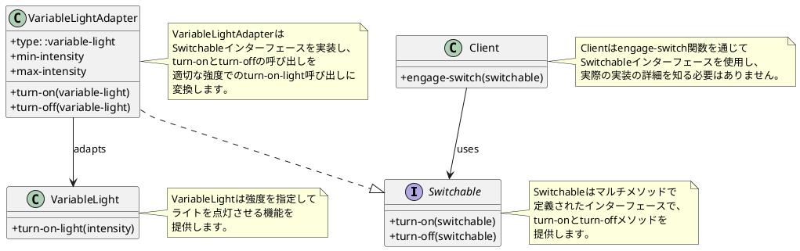

#### シーケンス図

以下は、Adapterパターンの実行フローを表すシーケンス図です：

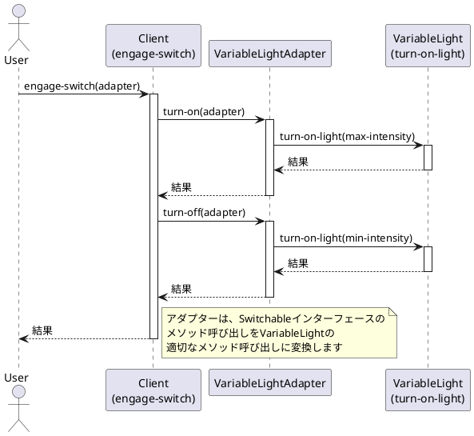

### Abstract Factoryパターン

Abstract Factoryパターンは、関連するオブジェクトのファミリーを、具体的なクラスを指定せずに生成するためのインターフェースを提供するパターンです。このパターンを使用すると、クライアントは生成されるオブジェクトの具体的なクラスを知ることなく、関連するオブジェクトを生成できます。

現在の実装では、異なる形状（円や四角形）を生成するファクトリーを提供しています。

```clojure
;; 形状ファクトリーインターフェース
(defmulti make (fn [factory type & args] (::type factory)))

;; 形状インターフェース
(defmulti translate (fn [shape dx dy] (::type shape)))
(defmulti scale (fn [shape factor] (::type shape)))
(defmulti to-string (fn [shape] (::type shape)))

;; 円の実装
(defn make-circle [center radius]
  {::shape/type ::circle
   ::center center
   ::radius radius})

(defmethod shape/translate ::circle [circle dx dy]
  (let [[x y] (::center circle)]
    (assoc circle ::center [(+ x dx) (+ y dy)])))

(defmethod shape/scale ::circle [circle factor]
  (let [radius (::radius circle)]
    (assoc circle ::radius (* radius factor))))

(defmethod shape/to-string ::circle [circle]
  (let [[x y] (::center circle)
        radius (::radius circle)]
    (str "Circle center: [" x ", " y "] radius: " radius)))

;; 四角形の実装
(defn make-square [top-left side]
  {::shape/type ::square
   ::top-left top-left
   ::side side})

(defmethod shape/translate ::square [square dx dy]
  (let [[x y] (::top-left square)]
    (assoc square ::top-left [(+ x dx) (+ y dy)])))

(defmethod shape/scale ::square [square factor]
  (let [side (::side square)]
    (assoc square ::side (* side factor))))

(defmethod shape/to-string ::square [square]
  (let [[x y] (::top-left square)
        side (::side square)]
    (str "Square top-left: [" x ", " y "] side: " side)))

;; 形状ファクトリーの実装
(defn make-factory []
  {::factory/type ::implementation})

(defmethod factory/make ::implementation
  [factory type & args]
  (condp = type
    :square (apply square/make args)
    :circle (apply circle/make args)))

;; クライアント
(def shape-factory (atom nil))

(defn init []
  (reset! shape-factory (make-factory)))

;; 使用例
(let [square (factory/make @shape-factory :square [100 100] 10)
      circle (factory/make @shape-factory :circle [100 100] 10)]
  (println (shape/to-string square))
  (println (shape/to-string circle)))
```

この実装では、マルチメソッドを使用してAbstract Factoryパターンを実現しています。`make`という共通のファクトリーインターフェースを定義し、具体的なファクトリー実装がこのインターフェースを実装しています。

ファクトリーは、要求された型（:squareや:circle）に基づいて適切な形状オブジェクトを生成します。クライアントは、具体的な形状クラスを知ることなく、ファクトリーを通じて形状オブジェクトを生成できます。

#### クラス図

以下は、Abstract Factoryパターンの実装を表すクラス図です：

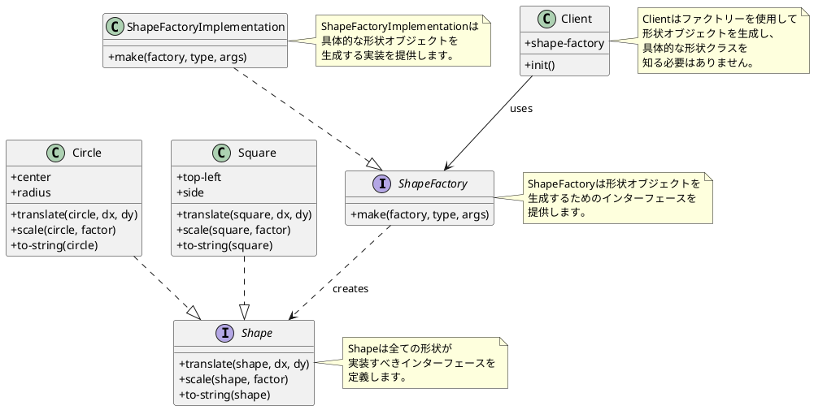

#### シーケンス図

以下は、Abstract Factoryパターンの実行フローを表すシーケンス図です：

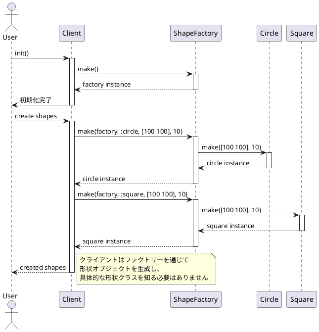

### Compositeパターン

Compositeパターンは、オブジェクトをツリー構造で構成し、個々のオブジェクトとオブジェクトの集合を同じように扱うことができるようにするパターンです。このパターンを使用すると、クライアントは個々のオブジェクトとその組み合わせを区別せずに操作できます。

現在の実装では、異なる形状（円や四角形）とそれらの組み合わせ（複合形状）を同じインターフェースで操作できるようにしています。

```clojure
;; 形状インターフェース
(defmulti translate (fn [shape dx dy] (::type shape)))
(defmulti scale (fn [shape factor] (::type shape)))

;; 円の実装
(defn make-circle [center radius]
  {::shape/type ::circle
   ::center center
   ::radius radius})

(defmethod shape/translate ::circle [circle dx dy]
  (let [[x y] (::center circle)]
    (assoc circle ::center [(+ x dx) (+ y dy)])))

(defmethod shape/scale ::circle [circle factor]
  (let [radius (::radius circle)]
    (assoc circle ::radius (* radius factor))))

;; 四角形の実装
(defn make-square [top-left side]
  {::shape/type ::square
   ::top-left top-left
   ::side side})

(defmethod shape/translate ::square [square dx dy]
  (let [[x y] (::top-left square)]
    (assoc square ::top-left [(+ x dx) (+ y dy)])))

(defmethod shape/scale ::square [square factor]
  (let [side (::side square)]
    (assoc square ::side (* side factor))))

;; 複合形状の実装
(defn make []
  {::shape/type ::composite-shape
   ::shapes []})

(defn add [cs shape]
  (update cs ::shapes conj shape))

(defmethod shape/translate ::composite-shape [cs dx dy]
  (let [translated-shapes (map #(shape/translate % dx dy)
                             (::shapes cs))]
      (assoc cs ::shapes translated-shapes)))

(defmethod shape/scale ::composite-shape [cs factor]
  (let [scaled-shapes (map #(shape/scale % factor)
                         (::shapes cs))]
    (assoc cs ::shapes scaled-shapes)))
```

この実装では、マルチメソッドを使用してCompositeパターンを実現しています。`translate`と`scale`という共通のインターフェースを定義し、各形状（円、四角形）とその複合形状に対して実装しています。

複合形状は他の形状を含むことができ、操作（移動やサイズ変更）が複合形状に適用されると、その操作は含まれるすべての形状に再帰的に適用されます。これにより、クライアントは個々の形状と複合形状を区別せずに同じ方法で操作できます。

#### クラス図

以下は、Compositeパターンの実装を表すクラス図です：

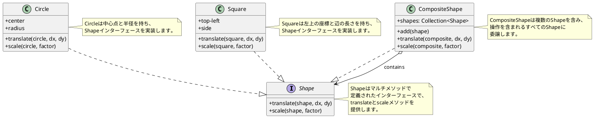

#### シーケンス図

以下は、Compositeパターンの実行フローを表すシーケンス図です：

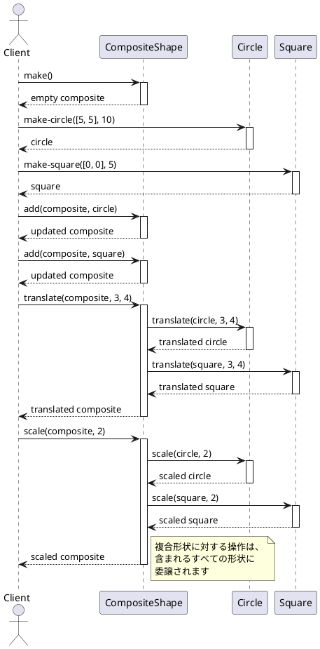

### Decoratorパターン

Decoratorパターンは、既存のオブジェクトに新しい機能を動的に追加するパターンです。このパターンを使用すると、サブクラス化による継承よりも柔軟な方法で機能を拡張できます。

現在の実装では、形状（Shape）オブジェクトに操作の履歴を記録する機能を追加するJournaledShapeデコレータを提供しています。

```clojure
;; デコレータの実装
(defn make [shape]
  {::shape/type ::journal-shape
   ::journal []
   ::shape shape})

(defmethod shape/translate ::journal-shape [js dx dy]
  (-> js (update ::journal conj [:translate dx dy])
      (assoc ::shape (shape/translate (::shape js) dx dy))))

(defmethod shape/scale ::journal-shape [js factor]
  (-> js (update ::journal conj [:scale factor])
      (assoc ::shape (shape/scale (::shape js) factor))))

;; デコレータの使用例
(let [journaled-square (-> (js/make (square/make-square [0 0] 1))
                           (shape/translate 2 3)
                           (shape/scale 5))]
  ;; ジャーナルには操作の履歴が記録されています
  ;; [[:translate 2 3] [:scale 5]]
  (::js/journal journaled-square))
```

この実装では、マルチメソッドを使用してDecoratorパターンを実現しています。`make`関数は既存の形状をラップし、新しいジャーナル機能を持つデコレータオブジェクトを作成します。

デコレータは元の形状と同じインターフェース（`translate`と`scale`）を実装していますが、操作を元の形状に委譲する前に、その操作をジャーナルに記録します。これにより、クライアントは通常の形状とデコレートされた形状を区別せずに同じ方法で操作できます。

#### クラス図

以下は、Decoratorパターンの実装を表すクラス図です：

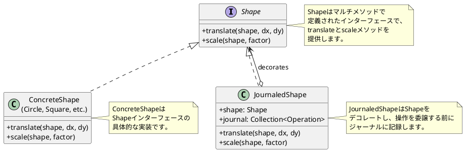

#### シーケンス図

以下は、Decoratorパターンの実行フローを表すシーケンス図です：

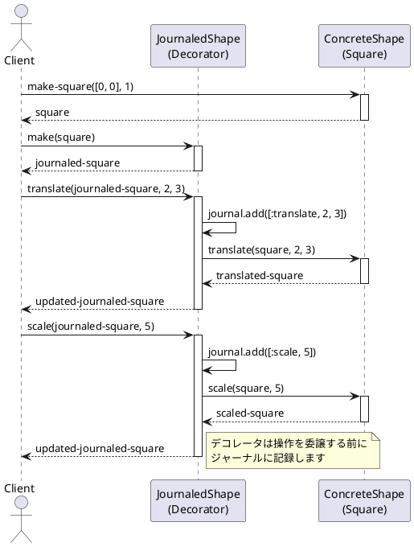

### Abstract Serverパターン

Abstract Serverパターンは、アルゴリズムのファミリーを定義し、それぞれをカプセル化して交換可能にするパターンです。Clojureでは、マルチメソッドを使用してこのパターンを実装しています。

現在の実装では、スイッチ可能なオブジェクト（例：ライト）に対して、オン/オフの操作を行うストラテジーを提供しています。

```clojure
;; プロトコルの定義
(defprotocol SwitchStrategy
  (turn-on [this switchable] "Turn on the switchable object")
  (turn-off [this switchable] "Turn off the switchable object"))

;; レコード形式の実装
(defrecord LightStrategy []
  SwitchStrategy
  (turn-on [_ switchable]
    (turn-on-light))
  (turn-off [_ switchable]
    (turn-off-light)))

;; 戦略を作成する関数
(defn create-strategy [switchable]
  (case (:type switchable)
    :light (->LightStrategy)
    nil))

;; スイッチを操作する関数
(defn engage-switch [switchable]
  (let [strategy (create-strategy switchable)]
    (if strategy
      (do
        (turn-on strategy switchable)
        (turn-off strategy switchable))
      (do
        ;; 後方互換性のためのマルチメソッド
        (legacy-turn-on switchable)
        (legacy-turn-off switchable)))))
```

この実装では、プロトコルとレコード形式を使用して、より明示的なインターフェースと実装を提供しています。`SwitchStrategy`プロトコルは、スイッチ可能なオブジェクトに対する操作を定義し、`LightStrategy`レコードはそのプロトコルを実装しています。

また、後方互換性のために、マルチメソッドベースの実装も維持しています。新しい実装では、`create-strategy`関数を使用して適切な戦略を作成し、それを使用してスイッチを操作します。

この実装により、新しいタイプのスイッチ可能なオブジェクトを追加する際に、新しいレコード型を定義し、プロトコルを実装するだけで拡張できます。

#### クラス図

以下は、Abstract Serverパターンの実装を表すクラス図です：

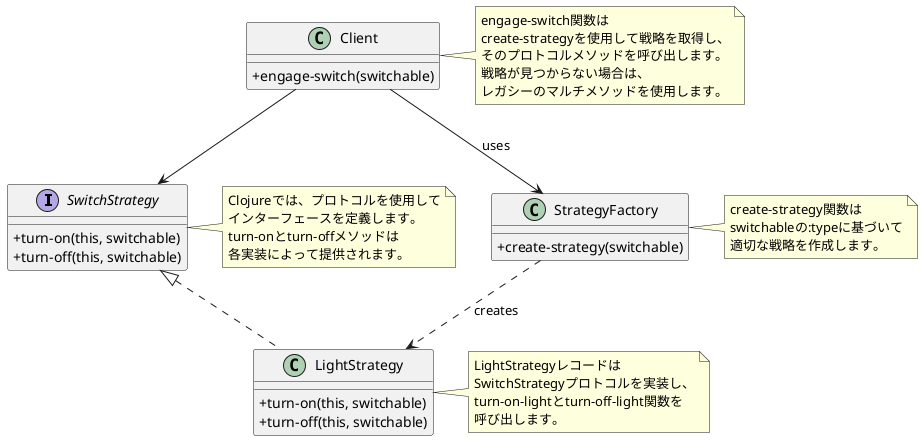

#### シーケンス図

以下は、Abstract Serverパターンの実行フローを表すシーケンス図です：

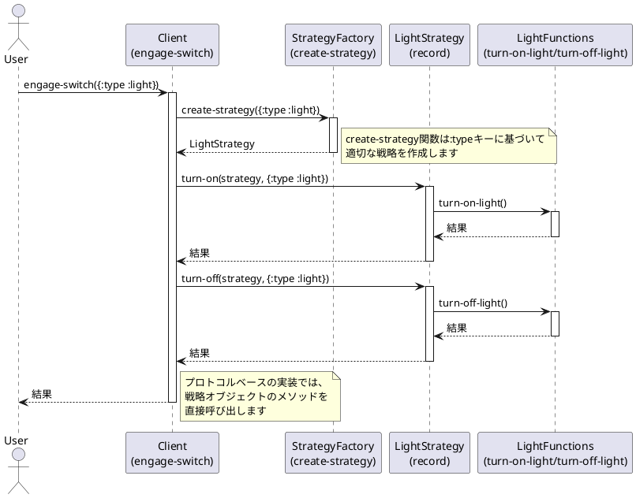

### Commandパターン

Commandパターンは、要求をオブジェクトとしてカプセル化し、それによって異なる要求やキューイング、ログ記録、取り消し可能な操作などのパラメータ化されたクライアントを可能にするパターンです。このパターンを使用すると、操作の実行を要求するオブジェクトと、その操作を実際に実行するオブジェクトを分離できます。

現在の実装では、GUIアプリケーションでの操作（部屋の追加など）とそのundo機能を実装しています。

```clojure
;; Commandインターフェース
(defmulti execute :type)
(defmulti undo :type)

;; 具体的なコマンド（AddRoomCommand）
(defn add-room []
  ;stuff that adds rooms to the canvas
  ;and returns added room
  )

(defn delete-room [room]
  ;stuff that deletes the specified room from the canvas
  )

(defn make-add-room-command []
  {:type :add-room-command})

(defmethod execute :add-room-command [command]
  (assoc (make-add-room-command) :the-added-room (add-room)))

(defmethod undo :add-room-command [command]
  (delete-room (:the-added-room command)))

;; クライアント
(defn some-app [command]
  ;Some other stuff...
  (command)
  ;Some more other stuff...
  )

;; GUIアプリケーション（Invoker）
(defn gui-app [actions]
  (loop [actions actions
         undo-list (list)]
    (if (empty? actions)
      :done-nl
      (condp = (first actions)
        :add-room-action
        (let [executed-command (execute
                                 (make-add-room-command))]
          (recur (rest actions)
                 (conj undo-list executed-command)))
        :undo-action
        (let [command-to-undo (first undo-list)]
          (undo command-to-undo)
          (recur (rest actions)
                 (rest undo-list)))
        :TILT))))
```

この実装では、マルチメソッドを使用してCommandパターンを実現しています。`execute`と`undo`マルチメソッドは、コマンドインターフェースを定義し、`:add-room-command`型のコマンドに対する具体的な実装を提供しています。

`gui-app`関数は、アクションのリストを受け取り、それらを順番に処理します。`:add-room-action`アクションが来ると、新しいコマンドを作成して実行し、undo-listに追加します。`:undo-action`アクションが来ると、undo-listから最新のコマンドを取り出し、それを元に戻します。

このパターンにより、GUIアプリケーションは実行される具体的な操作を知る必要がなく、単にコマンドを実行・元に戻すだけで済みます。また、新しい操作を追加する際には、新しいコマンド型を定義し、`execute`と`undo`マルチメソッドに対する実装を提供するだけで済みます。

#### クラス図

以下は、Commandパターンの実装を表すクラス図です：

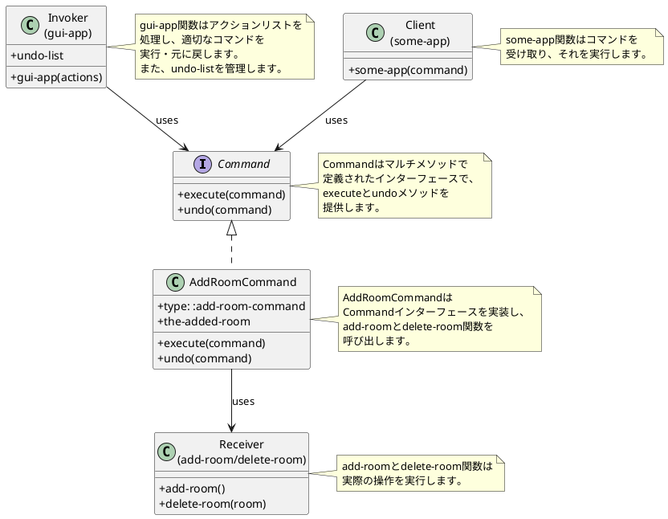

#### シーケンス図

以下は、Commandパターンの実行フローを表すシーケンス図です：

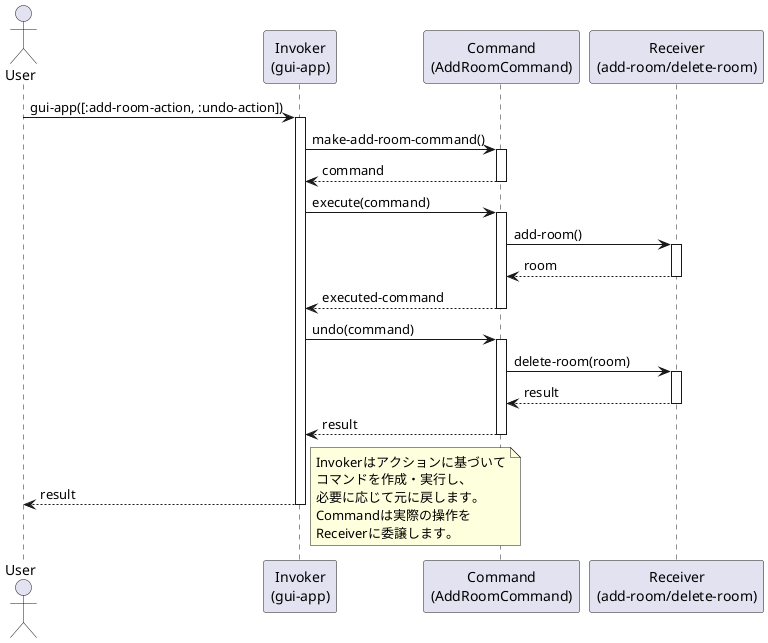

### Visitorパターン

Visitorパターンは、オブジェクト構造の要素に対して実行する操作を表現し、操作を変更せずに新しい操作を定義できるようにするパターンです。このパターンを使用すると、操作の対象となるオブジェクト構造を変更せずに、新しい操作を追加できます。

現在の実装では、異なる形状（円や四角形）をJSON形式に変換する操作を提供しています。

```clojure
;; 形状インターフェース
(defmulti translate (fn [shape dx dy] (::type shape)))
(defmulti scale (fn [shape factor] (::type shape)))

;; 円の実装
(defn make [center radius]
  {::shape/type ::circle
   ::center center
   ::radius radius})

(defmethod shape/translate ::circle [circle dx dy]
  (let [[x y] (::center circle)]
    (assoc circle ::center [(+ x dx) (+ y dy)])))

(defmethod shape/scale ::circle [circle factor]
  (let [radius (::radius circle)]
    (assoc circle ::radius (* radius factor))))

;; 四角形の実装
(defn make [top-left side]
  {::shape/type ::square
   ::top-left top-left
   ::side side})

(defmethod shape/translate ::square [square dx dy]
  (let [[x y] (::top-left square)]
    (assoc square ::top-left [(+ x dx) (+ y dy)])))

(defmethod shape/scale ::square [square factor]
  (let [side (::side square)]
    (assoc square ::side (* side factor))))

;; Visitorインターフェース
(defmulti to-json ::shape/type)

;; 具体的なVisitor実装
(defmethod to-json ::square/square [square]
  (let [{:keys [::square/top-left ::square/side]} square
        [x y] top-left]
    (format "{\"top-left\":[%s,%s],\"side\": %s}" x y side)))

(defmethod to-json ::circle/circle [circle]
  (let [{:keys [::circle/center ::circle/radius]} circle
        [x y] center]
    (format "{\"center\":[%s,%s],\"radius\": %s}" x y radius)))

;; Visitorの使用例
(to-json (square/make [0 0] 1)) ;; => "{\"top-left\":[0,0],\"side\": 1}"
(to-json (circle/make [3 4] 1)) ;; => "{\"center\":[3,4],\"radius\": 1}"
```

この実装では、マルチメソッドを使用してVisitorパターンを実現しています。`to-json`マルチメソッドは、異なる形状タイプに対して異なる実装を提供するVisitorです。

各形状（円、四角形）は、自身の構造を変更せずに、Visitorによって新しい操作（JSON変換）を受け入れることができます。新しい形状タイプを追加する場合は、その形状に対する`to-json`メソッドを実装するだけで、既存のコードを変更せずに拡張できます。

また、新しい操作（例えばXML変換）を追加したい場合は、新しいマルチメソッド（例えば`to-xml`）を定義し、各形状タイプに対する実装を提供するだけで、既存の形状クラスを変更せずに拡張できます。

#### クラス図

以下は、Visitorパターンの実装を表すクラス図です：

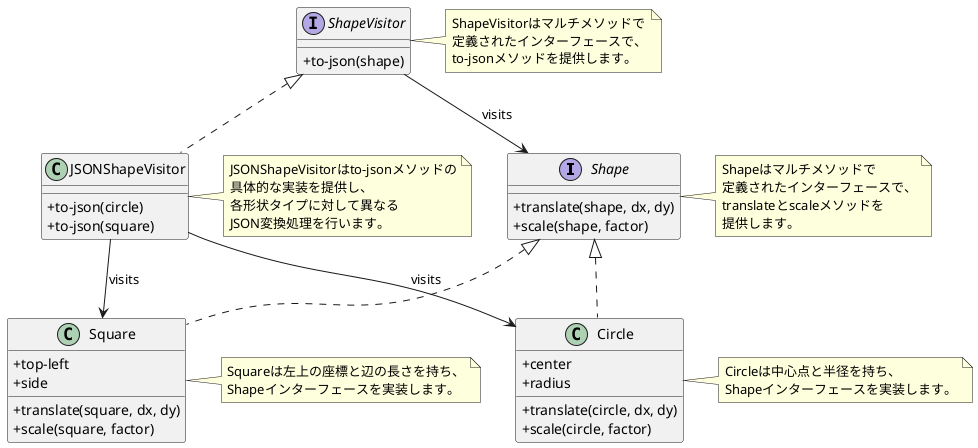

#### シーケンス図

以下は、Visitorパターンの実行フローを表すシーケンス図です：

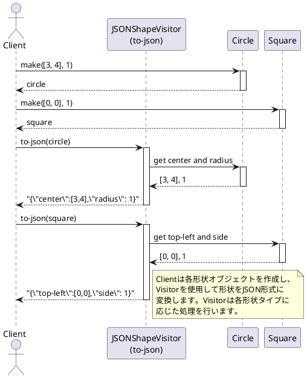
## インストール

[Clojure](https://clojure.org/guides/getting_started)とClojure CLIツールがインストールされていることを確認してください。

このリポジトリをクローンし、プロジェクトディレクトリに移動します：

```bash
git clone <repository-url>
cd design-pattern
```

## 使用方法

コア機能は`design-pattern.core`名前空間によって提供されています。各デザインパターンは独自の名前空間を持っています。

例えば、Abstract Serverパターンを使用するには：

```clojure
(require '[design-pattern.abstract-server :refer :all])

;; ライトを操作する
(engage-switch {:type :light})
```

## テストの実行

このプロジェクトはテスト用に[speclj](https://github.com/slagyr/speclj)を使用しています。テストを実行するには：

```bash
clojure -M:spec
```

このプロジェクトはClojureの組み込みテストフレームワークもサポートしています：

```bash
clojure -M:test
```

## ライセンス

このプロジェクトは[MITライセンス](LICENSE)の下で利用可能です。
