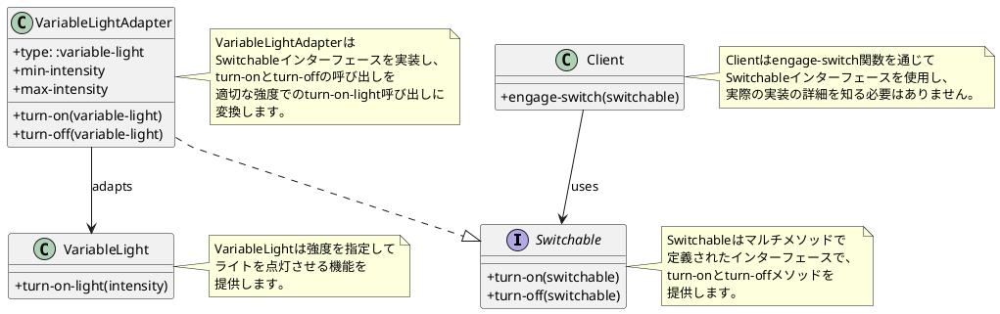
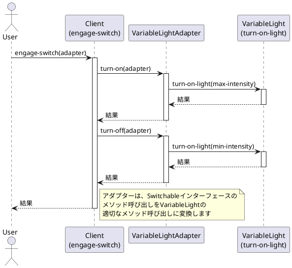
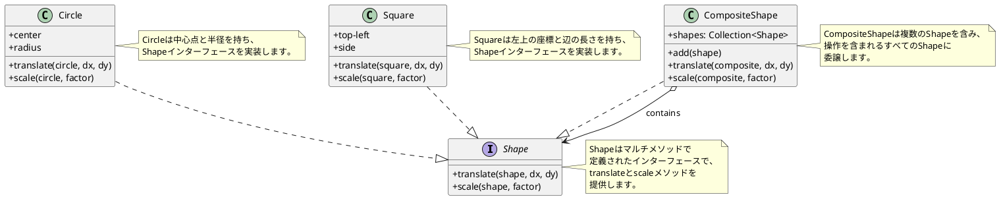
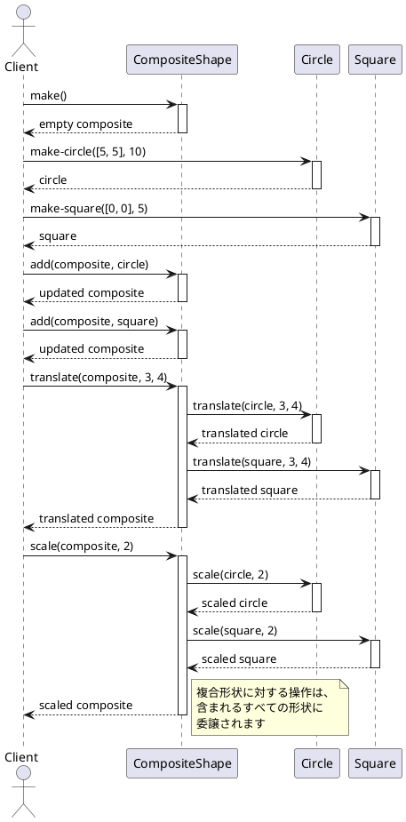
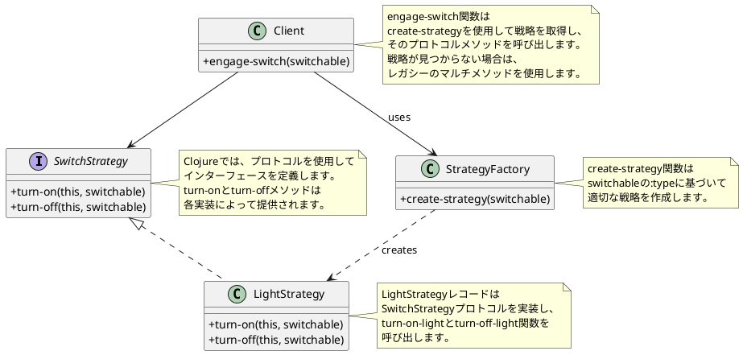
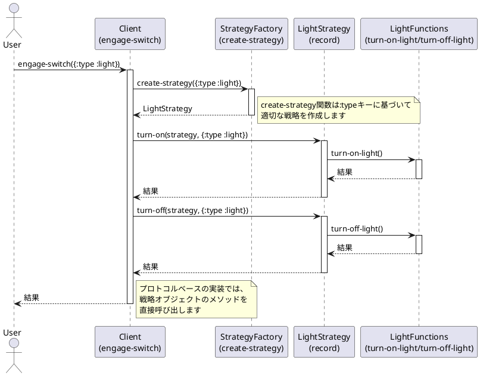

# デザインパターン in Clojure

このモジュールは、Clojureでの様々なデザインパターンの実装を提供します。このプロジェクトは、関数型プログラミング言語であるClojureでオブジェクト指向デザインパターンをどのように適用または適応させるかを示しています。

## 概要

このプロジェクトでは、以下のデザインパターンの実装を提供しています：

### Adapterパターン

Adapterパターンは、既存のクラスのインターフェースを、クライアントが期待する別のインターフェースに変換するパターンです。このパターンを使用すると、互換性のないインターフェースを持つクラス同士を連携させることができます。

現在の実装では、可変強度を持つライト（VariableLight）を、単純なオン/オフ機能を持つSwitchableインターフェースに適応させています。

```clojure
;; Switchableインターフェース（ターゲット）
(defmulti turn-on :type)
(defmulti turn-off :type)

;; VariableLight（アダプティー）
(defn turn-on-light [intensity]
  ;Turn it on with intensity.
  )

;; VariableLightAdapter（アダプター）
(defn make-adapter [min-intensity max-intensity]
  {:type :variable-light
   :min-intensity min-intensity
   :max-intensity max-intensity})

(defmethod turn-on :variable-light [variable-light]
  (turn-on-light (:max-intensity variable-light)))

(defmethod turn-off :variable-light [variable-light]
  (turn-on-light (:min-intensity variable-light)))

;; クライアント
(defn engage-switch [switchable]
  (turn-on switchable)
  (turn-off switchable))
```

この実装では、マルチメソッドを使用してアダプターパターンを実現しています。`variable-light-adapter`は、可変強度を持つライトを単純なオン/オフインターフェースに適応させるアダプターです。

アダプターは、`turn-on`を最大強度でのライト点灯に、`turn-off`を最小強度でのライト点灯にマッピングします。これにより、可変強度ライトを通常のスイッチと同じように扱うことができます。

#### クラス図

以下は、Adapterパターンの実装を表すクラス図です：



#### シーケンス図

以下は、Adapterパターンの実行フローを表すシーケンス図です：



### Compositeパターン

Compositeパターンは、オブジェクトをツリー構造で構成し、個々のオブジェクトとオブジェクトの集合を同じように扱うことができるようにするパターンです。このパターンを使用すると、クライアントは個々のオブジェクトとその組み合わせを区別せずに操作できます。

現在の実装では、異なる形状（円や四角形）とそれらの組み合わせ（複合形状）を同じインターフェースで操作できるようにしています。

```clojure
;; 形状インターフェース
(defmulti translate (fn [shape dx dy] (::type shape)))
(defmulti scale (fn [shape factor] (::type shape)))

;; 円の実装
(defn make-circle [center radius]
  {::shape/type ::circle
   ::center center
   ::radius radius})

(defmethod shape/translate ::circle [circle dx dy]
  (let [[x y] (::center circle)]
    (assoc circle ::center [(+ x dx) (+ y dy)])))

(defmethod shape/scale ::circle [circle factor]
  (let [radius (::radius circle)]
    (assoc circle ::radius (* radius factor))))

;; 四角形の実装
(defn make-square [top-left side]
  {::shape/type ::square
   ::top-left top-left
   ::side side})

(defmethod shape/translate ::square [square dx dy]
  (let [[x y] (::top-left square)]
    (assoc square ::top-left [(+ x dx) (+ y dy)])))

(defmethod shape/scale ::square [square factor]
  (let [side (::side square)]
    (assoc square ::side (* side factor))))

;; 複合形状の実装
(defn make []
  {::shape/type ::composite-shape
   ::shapes []})

(defn add [cs shape]
  (update cs ::shapes conj shape))

(defmethod shape/translate ::composite-shape [cs dx dy]
  (let [translated-shapes (map #(shape/translate % dx dy)
                             (::shapes cs))]
      (assoc cs ::shapes translated-shapes)))

(defmethod shape/scale ::composite-shape [cs factor]
  (let [scaled-shapes (map #(shape/scale % factor)
                         (::shapes cs))]
    (assoc cs ::shapes scaled-shapes)))
```

この実装では、マルチメソッドを使用してCompositeパターンを実現しています。`translate`と`scale`という共通のインターフェースを定義し、各形状（円、四角形）とその複合形状に対して実装しています。

複合形状は他の形状を含むことができ、操作（移動やサイズ変更）が複合形状に適用されると、その操作は含まれるすべての形状に再帰的に適用されます。これにより、クライアントは個々の形状と複合形状を区別せずに同じ方法で操作できます。

#### クラス図

以下は、Compositeパターンの実装を表すクラス図です：



#### シーケンス図

以下は、Compositeパターンの実行フローを表すシーケンス図です：



### Abstract Serverパターン

Abstract Serverパターンは、アルゴリズムのファミリーを定義し、それぞれをカプセル化して交換可能にするパターンです。Clojureでは、マルチメソッドを使用してこのパターンを実装しています。

現在の実装では、スイッチ可能なオブジェクト（例：ライト）に対して、オン/オフの操作を行うストラテジーを提供しています。

```clojure
;; プロトコルの定義
(defprotocol SwitchStrategy
  (turn-on [this switchable] "Turn on the switchable object")
  (turn-off [this switchable] "Turn off the switchable object"))

;; レコード形式の実装
(defrecord LightStrategy []
  SwitchStrategy
  (turn-on [_ switchable]
    (turn-on-light))
  (turn-off [_ switchable]
    (turn-off-light)))

;; 戦略を作成する関数
(defn create-strategy [switchable]
  (case (:type switchable)
    :light (->LightStrategy)
    nil))

;; スイッチを操作する関数
(defn engage-switch [switchable]
  (let [strategy (create-strategy switchable)]
    (if strategy
      (do
        (turn-on strategy switchable)
        (turn-off strategy switchable))
      (do
        ;; 後方互換性のためのマルチメソッド
        (legacy-turn-on switchable)
        (legacy-turn-off switchable)))))
```

この実装では、プロトコルとレコード形式を使用して、より明示的なインターフェースと実装を提供しています。`SwitchStrategy`プロトコルは、スイッチ可能なオブジェクトに対する操作を定義し、`LightStrategy`レコードはそのプロトコルを実装しています。

また、後方互換性のために、マルチメソッドベースの実装も維持しています。新しい実装では、`create-strategy`関数を使用して適切な戦略を作成し、それを使用してスイッチを操作します。

この実装により、新しいタイプのスイッチ可能なオブジェクトを追加する際に、新しいレコード型を定義し、プロトコルを実装するだけで拡張できます。

#### クラス図

以下は、Abstract Serverパターンの実装を表すクラス図です：



#### シーケンス図

以下は、Abstract Serverパターンの実行フローを表すシーケンス図です：



## インストール

[Clojure](https://clojure.org/guides/getting_started)とClojure CLIツールがインストールされていることを確認してください。

このリポジトリをクローンし、プロジェクトディレクトリに移動します：

```bash
git clone <repository-url>
cd design-pattern
```

## 使用方法

コア機能は`design-pattern.core`名前空間によって提供されています。各デザインパターンは独自の名前空間を持っています。

例えば、Abstract Serverパターンを使用するには：

```clojure
(require '[design-pattern.abstract-server :refer :all])

;; ライトを操作する
(engage-switch {:type :light})
```

## テストの実行

このプロジェクトはテスト用に[speclj](https://github.com/slagyr/speclj)を使用しています。テストを実行するには：

```bash
clojure -M:spec
```

このプロジェクトはClojureの組み込みテストフレームワークもサポートしています：

```bash
clojure -M:test
```

## ライセンス

このプロジェクトは[MITライセンス](LICENSE)の下で利用可能です。
