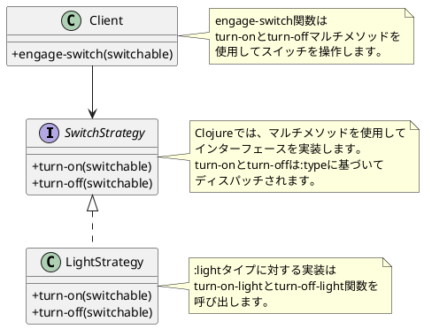
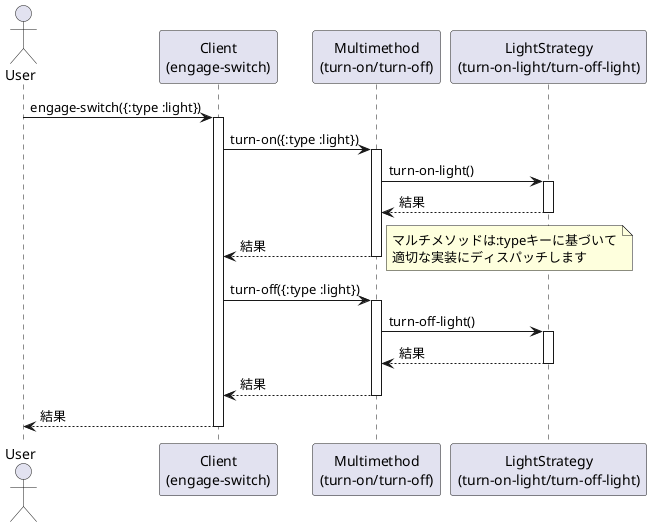

# デザインパターン in Clojure

このモジュールは、Clojureでの様々なデザインパターンの実装を提供します。このプロジェクトは、関数型プログラミング言語であるClojureでオブジェクト指向デザインパターンをどのように適用または適応させるかを示しています。

## 概要

このプロジェクトでは、以下のデザインパターンの実装を提供しています：

### Abstract Serverパターン

Abstract Serverパターンは、アルゴリズムのファミリーを定義し、それぞれをカプセル化して交換可能にするパターンです。Clojureでは、マルチメソッドを使用してこのパターンを実装しています。

現在の実装では、スイッチ可能なオブジェクト（例：ライト）に対して、オン/オフの操作を行うストラテジーを提供しています。

```clojure
;; マルチメソッドの定義
(defmulti turn-on :type)
(defmulti turn-off :type)

;; ライト用の実装
(defmethod turn-on :light [switchable]
  (turn-on-light))

(defmethod turn-off :light [switchable]
  (turn-off-light))

;; スイッチを操作する関数
(defn engage-switch [switchable]
  (turn-on switchable)
  (turn-off switchable))
```

この実装では、`:type`キーに基づいてディスパッチするマルチメソッドを使用しています。これにより、新しいタイプのスイッチ可能なオブジェクトを追加する際に、既存のコードを変更することなく拡張できます。

#### クラス図

以下は、Abstract Serverパターンの実装を表すクラス図です：



#### シーケンス図

以下は、Abstract Serverパターンの実行フローを表すシーケンス図です：



## インストール

[Clojure](https://clojure.org/guides/getting_started)とClojure CLIツールがインストールされていることを確認してください。

このリポジトリをクローンし、プロジェクトディレクトリに移動します：

```bash
git clone <repository-url>
cd design-pattern
```

## 使用方法

コア機能は`design-pattern.core`名前空間によって提供されています。各デザインパターンは独自の名前空間を持っています。

例えば、Abstract Serverパターンを使用するには：

```clojure
(require '[design-pattern.core :refer :all])

;; ライトを操作する
(engage-switch {:type :light})
```

## テストの実行

このプロジェクトはテスト用に[speclj](https://github.com/slagyr/speclj)を使用しています。テストを実行するには：

```bash
clojure -M:spec
```

このプロジェクトはClojureの組み込みテストフレームワークもサポートしています：

```bash
clojure -M:test
```

## ライセンス

このプロジェクトは[MITライセンス](LICENSE)の下で利用可能です。
