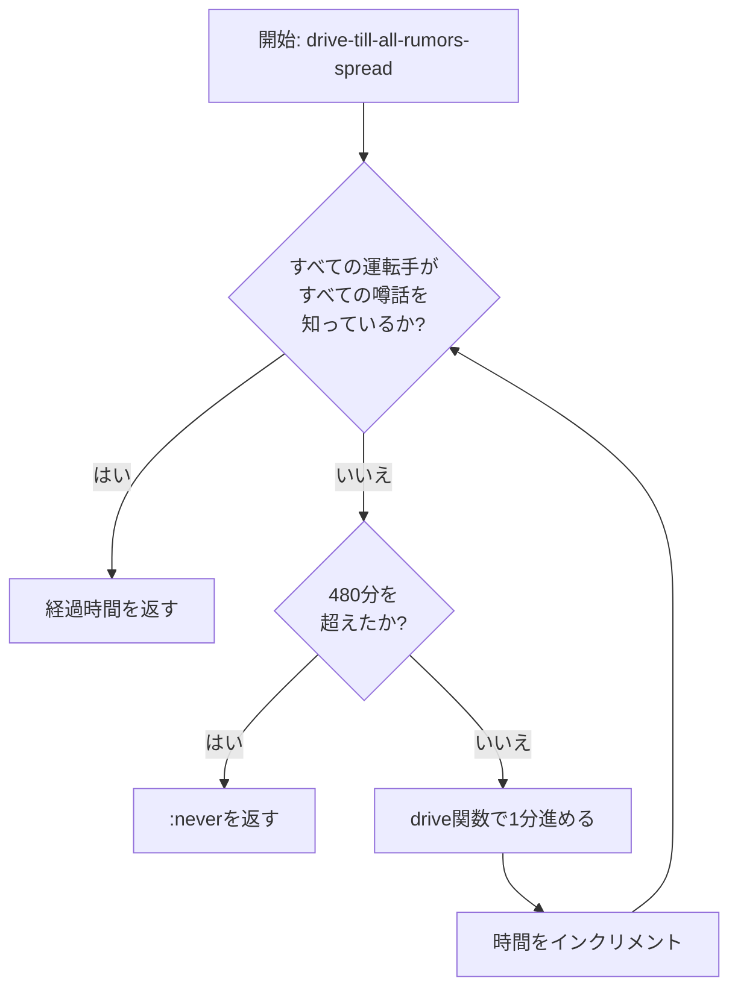
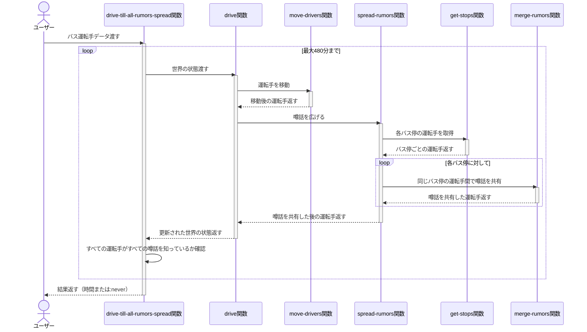

# ゴシップ好きなバスの運転手

ゴシップ好きなバスの運転手問題のClojure実装です。このプロジェクトは、Clojureにおける関数型プログラミングの原則とテスト駆動開発を示しています。

## 概要

このアプリケーションは、バスの運転手が路線上で出会った時に噂話を共有するシミュレーションを実装しています。この実装は以下を処理します：

- バス運転手の路線上の移動
- 同じバス停で出会った運転手間での噂話の共有
- すべての運転手がすべての噂話を知るまでの時間の計算
- 噂話が完全に広がらない場合の検出

## インストール

[Clojure](https://clojure.org/guides/getting_started)とClojure CLIツールがインストールされていることを確認してください。

このリポジトリをクローンし、プロジェクトディレクトリに移動します：

```bash
git clone <repository-url>
cd gossipingBusDrivers
```

## 使用方法

コア機能は`gossipingBusDrivers.core`名前空間によって提供されています。使用方法は以下の通りです：

```clojure
(require '[gossipingBusDrivers.core :refer :all])

;; バス運転手のデータを用意
(def world [(make-driver "d1" [3 1 2 3] #{1})
            (make-driver "d2" [3 2 3 1] #{2})
            (make-driver "d3" [4 2 3 4 5] #{3})])

;; すべての噂話が広がるまでの時間を計算
(drive-till-all-rumors-spread world)
;; => 6
```

## テストの実行

このプロジェクトはテスト用に[speclj](https://github.com/slagyr/speclj)を使用しています。テストを実行するには：

```bash
clojure -M:spec
```

このプロジェクトはClojureの組み込みテストフレームワークもサポートしています：

```bash
clojure -M:test
```

## 実装の詳細

この実装は関数型アプローチに従っています：

- `make-driver`: 名前、路線、噂話を持つバス運転手を作成します
- `move-driver`: 運転手を路線上の次のバス停に移動させます
- `move-drivers`: すべての運転手を次のバス停に移動させます
- `get-stops`: 各バス停にいる運転手のマップを作成します
- `merge-rumors`: 同じバス停にいる運転手間で噂話を共有します
- `spread-rumors`: すべてのバス停で噂話を広げます
- `drive`: 運転手を移動させ、噂話を広げる1分間のシミュレーションを実行します
- `drive-till-all-rumors-spread`: すべての運転手がすべての噂話を知るまでシミュレーションを実行し、必要な時間を返します

## ゴシップ好きなバスの運転手問題のルール

ゴシップ好きなバスの運転手問題では：

- 各バス運転手は固有の路線を持ち、1分ごとに次のバス停に移動します
- 各運転手は最初、自分だけが知っている噂話を1つ持っています
- 同じバス停で出会った運転手は、お互いの知っているすべての噂話を共有します
- 目標は、すべての運転手がすべての噂話を知るまでに何分かかるかを計算することです
- 路線の構成によっては、すべての運転手が出会うことができず、噂話が完全に広がらない場合があります
- シミュレーションは最大480分（8時間）まで実行され、それ以上かかる場合は「決して広がらない」と判断されます

### アルゴリズムの詳細

本実装では、ゴシップ好きなバスの運転手問題を解くために再帰的なアプローチを採用しています。主要な処理は`drive`関数と`drive-till-all-rumors-spread`関数によって行われます。

### フローチャート（Mermaid）



### シーケンス図（Mermaid）



### `drive`関数の処理

```clojure
(defn drive [world]
  (-> world move-drivers spread-rumors))
```

この関数は1分間のシミュレーションを実行します：

1. すべての運転手を次のバス停に移動させます
2. 同じバス停にいる運転手間で噂話を共有します

### `drive-till-all-rumors-spread`関数の処理

```clojure
(defn drive-till-all-rumors-spread [world]
  (loop [world (drive world)
         time 1]
    (cond
      (> time 480) :never
      (apply = (map :rumors world)) time
      :else (recur (drive world) (inc time)))))
```

この関数はシミュレーションを繰り返し実行します：

1. 初期状態から開始し、1分間のシミュレーションを実行します
2. すべての運転手の噂話セットが同じになったら（すべての運転手がすべての噂話を知っている）、経過時間を返します
3. 480分（8時間）を超えても噂話が完全に広がらない場合は、`:never`を返します

## ライセンス

このプロジェクトは[MITライセンス](LICENSE)の下で利用可能です。
