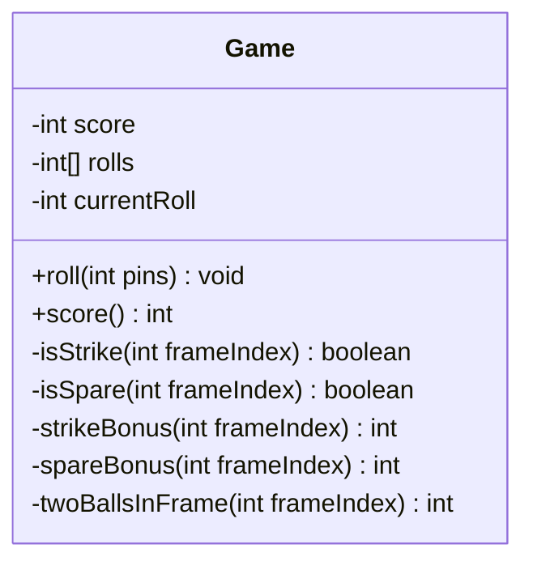
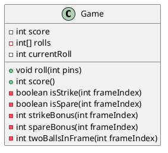
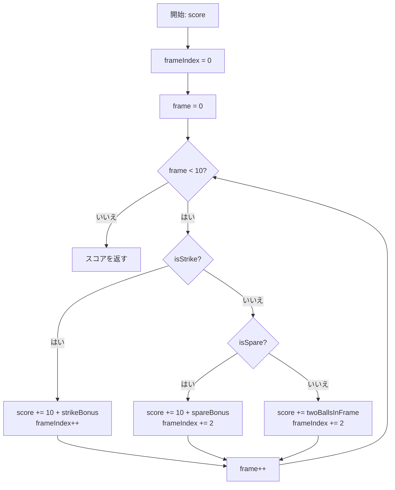
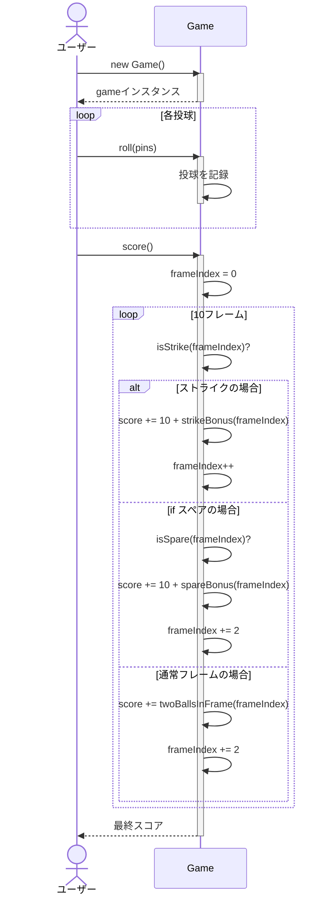
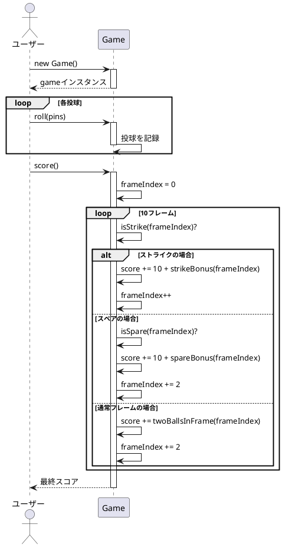
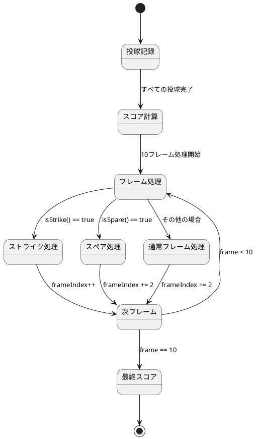

# ボウリングゲームスコア計算機

ボウリングゲームのスコア計算機のJava実装です。このプロジェクトは、Javaにおけるオブジェクト指向プログラミングの原則とテスト駆動開発を示しています。

## 概要

このアプリケーションは、標準的な10ピンボウリングゲームのスコア計算ルールを実装しています。この実装は以下を処理します：

- 基本的なスコアリング
- スペア（2投で10ピンすべてを倒す）
- ストライク（1投で10ピンすべてを倒す）
- 10フレーム目のボーナス投球

## インストール

[Java](https://www.oracle.com/java/technologies/javase-downloads.html)と[JUnit 5](https://junit.org/junit5/)がインストールされていることを確認してください。

このリポジトリをクローンし、プロジェクトディレクトリに移動します：

```bash
git clone <repository-url>
cd bowlinggame
```

## 使用方法

コア機能は`bowling.Game`クラスによって提供されています。使用方法は以下の通りです：

```java
import bowling.Game;

// ゲームインスタンスを作成
Game game = new Game();

// 投球を記録
game.roll(10); // ストライク
game.roll(7);
game.roll(2);
// ... 残りの投球

// スコアを計算
int finalScore = game.score();
```

## テストの実行

このプロジェクトはテスト用にJUnit 5を使用しています。テストを実行するには：

```bash
# コマンドラインからJUnitテストを実行
java -jar junit-platform-console-standalone.jar -cp out/production/bowlinggame -p bowling
```

または、お好みのIDEからテストを実行することもできます。

## 実装の詳細

この実装はオブジェクト指向アプローチに従っています：

- `Game`クラス: ボウリングゲームのメインロジックを含む
  - `roll(int pins)`: 投球を記録するメソッド
  - `score()`: 最終スコアを計算するメソッド
  - 補助メソッド: `isStrike()`, `isSpare()`, `strikeBonus()`, `spareBonus()`, `twoBallsInFrame()`

## ボウリングのスコアリングルール

ボウリングでは：
- ゲームは10フレームで構成されています
- 各フレームで、プレイヤーは10ピンを倒す2回のチャンスがあります
- フレームのスコアは、倒れたピンの合計数に、ストライクとスペアのボーナスを加えたものです
- スペアは、プレイヤーが2回の試行で10ピンすべてを倒した場合です。ボーナスは次の投球の値です
- ストライクは、プレイヤーが最初の試行で10ピンすべてを倒した場合です。ボーナスは次の2回の投球の値です
- 10フレーム目では、スペアまたはストライクを投げたプレイヤーは、フレームを完了するために追加の球を投げることが許可されます（最大3投まで）

### スコアリング例

以下の表は、異なるシナリオでのスコア計算方法を示しています：

| シナリオ | 投球 | 計算方法 | スコア |
|---------|------|---------|-------|
| 通常フレーム | 3, 5 | 3 + 5 = 8 | 8 |
| スペア | 7, 3, 次の投球: 4 | 7 + 3 + 4(ボーナス) = 14 | 14 |
| ストライク | 10, 次の2投: 8, 1 | 10 + 8 + 1(ボーナス) = 19 | 19 |
| 連続ストライク | 10, 10, 10 | 10 + 10 + 10(ボーナス) = 30 | 30 |
| パーフェクトゲーム | 12回連続ストライク | 10 + (10 + 10) × 9 + 10 + 10 = 300 | 300 |
| ガターゲーム | すべて0 | 0 × 20 = 0 | 0 |

## アルゴリズムの詳細

本実装では、ボウリングスコアの計算にイテレーティブなアプローチを採用しています。主要な処理は`score()`メソッドによって行われ、各フレームのタイプ（ストライク、スペア、通常）に応じて適切なスコア計算を行います。

### クラス図（Mermaid）



### クラス図（PlantUML）



### フローチャート（Mermaid）



### シーケンス図（Mermaid）



### シーケンス図（PlantUML）



### ステートチャート（PlantUML）



## ライセンス

このプロジェクトは[MITライセンス](LICENSE)の下で利用可能です。
