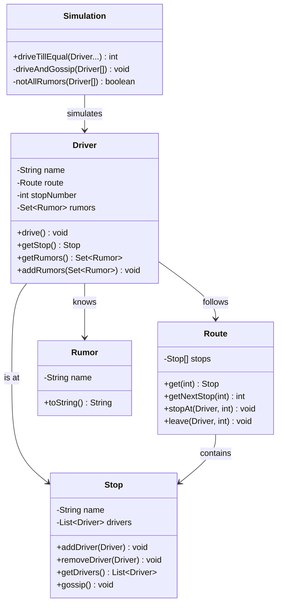
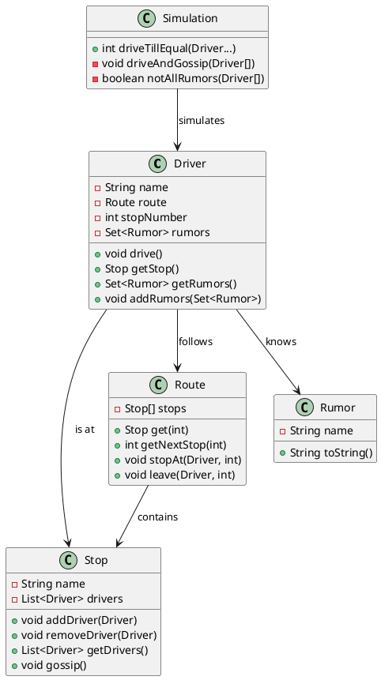
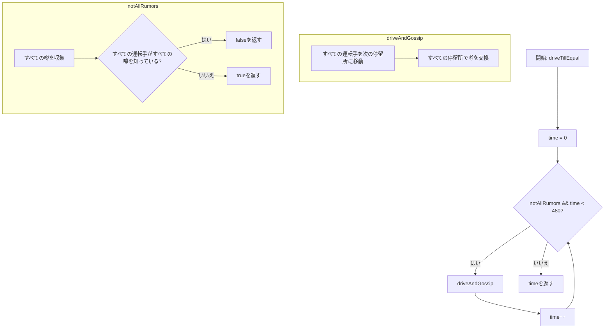
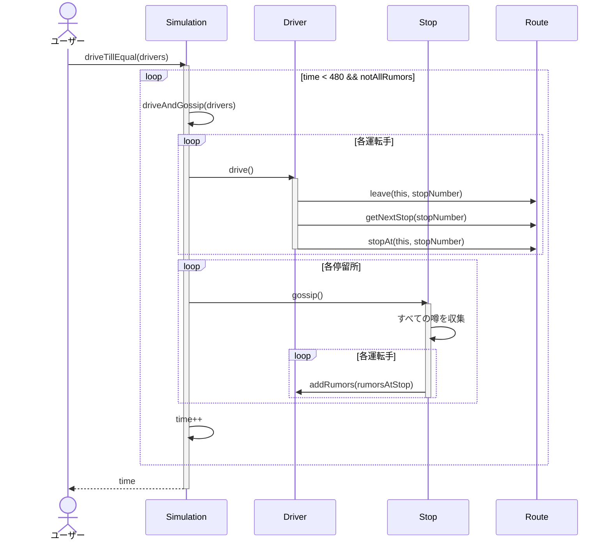
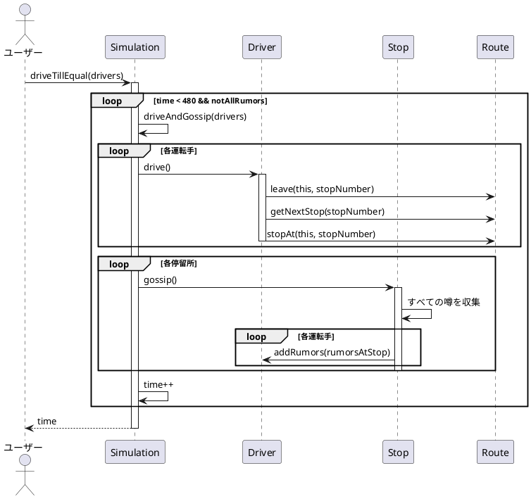
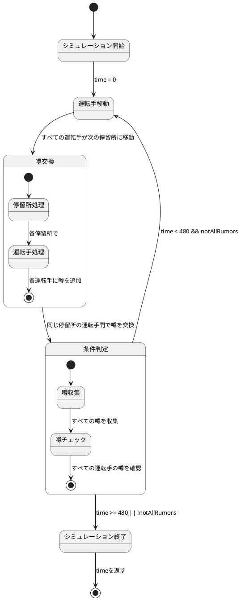

# ゴシップ好きなバス運転手シミュレーション

ゴシップ好きなバス運転手シミュレーションのJava実装です。このプロジェクトは、Javaにおけるオブジェクト指向プログラミングの原則とテスト駆動開発を示しています。

## 概要

このアプリケーションは、ゴシップ好きなバス運転手が路線上を移動し、停留所で出会った時に噂（ゴシップ）を交換するシミュレーションを実装しています。この実装は以下を処理します：

- ゴシップ好きなバス運転手の路線に沿った移動
- 停留所での複数運転手間の噂の交換
- すべての運転手がすべての噂を知るまでの時間計算
- 時間制限内（480ステップ）で全ての噂が共有できるかの判定

## インストール

[Java](https://www.oracle.com/java/technologies/javase-downloads.html)と[JUnit 5](https://junit.org/junit5/)がインストールされていることを確認してください。

このリポジトリをクローンし、プロジェクトディレクトリに移動します：

```bash
git clone <repository-url>
cd gossipingBusDrivers
```

## 使用方法

コア機能は`gossipingBusDrivers.Simulation`クラスによって提供されています。使用方法は以下の通りです：

```java
import gossipingBusDrivers.*;

// 停留所を作成
Stop stop1 = new Stop("stop1");
Stop stop2 = new Stop("stop2");
Stop stop3 = new Stop("stop3");

// 路線を作成
Route route1 = new Route(stop1, stop2, stop3);
Route route2 = new Route(stop2, stop3, stop1);

// 噂を作成
Rumor rumor1 = new Rumor("rumor1");
Rumor rumor2 = new Rumor("rumor2");

// ゴシップ好きなバス運転手を作成（各運転手は初期の噂を持っています）
Driver driver1 = new Driver("driver1", route1, rumor1);
Driver driver2 = new Driver("driver2", route2, rumor2);

// シミュレーションを実行し、すべての運転手がすべての噂を知るまでの時間を計算
int timeSteps = Simulation.driveTillEqual(driver1, driver2);

// 結果を表示
if (timeSteps < 480) {
    System.out.println("すべての運転手が" + timeSteps + "ステップですべての噂を共有しました。");
} else {
    System.out.println("時間制限内ですべての噂を共有できませんでした。");
}
```

## テストの実行

このプロジェクトはテスト用にJUnit 5を使用しています。テストを実行するには：

```bash
# コマンドラインからJUnitテストを実行
java -jar junit-platform-console-standalone.jar -cp out/production/gossipingBusDrivers -p gossipingBusDrivers
```

または、お好みのIDEからテストを実行することもできます。

## 実装の詳細

この実装はオブジェクト指向アプローチに従っています：

- `Driver`クラス: ゴシップ好きなバス運転手を表し、路線上の移動と噂の管理を行う
  - `drive()`: 次の停留所に移動するメソッド
  - `addRumors()`: 新しい噂を追加するメソッド
  - `getRumors()`: 現在知っている噂を取得するメソッド
  - `getStop()`: 現在いる停留所を取得するメソッド

- `Stop`クラス: バス停留所を表し、運転手間の噂の交換を管理する
  - `addDriver()`: 運転手を停留所に追加するメソッド
  - `removeDriver()`: 運転手を停留所から削除するメソッド
  - `gossip()`: 停留所にいるすべての運転手間で噂を交換するメソッド

- `Route`クラス: バス路線を表し、停留所の順序を管理する
  - `get()`: 指定されたインデックスの停留所を取得するメソッド
  - `getNextStop()`: 次の停留所のインデックスを計算するメソッド
  - `stopAt()`: 運転手を停留所に到着させるメソッド
  - `leave()`: 運転手を停留所から出発させるメソッド

- `Rumor`クラス: 噂を表す単純なクラス
  - 噂の識別子としての名前を持つ

- `Simulation`クラス: シミュレーション全体を制御する
  - `driveTillEqual()`: すべての運転手がすべての噂を知るまでシミュレーションを実行するメソッド
  - `driveAndGossip()`: 1ステップのシミュレーションを実行するメソッド
  - `notAllRumors()`: すべての運転手がすべての噂を知っているかをチェックするメソッド

## シミュレーションのルール

このシミュレーションでは：
- 各ゴシップ好きなバス運転手は固定された循環路線に沿って移動します
- 各運転手は初期状態で1つ以上の固有の噂を知っています
- 各時間ステップで、すべての運転手は次の停留所に移動します
- 同じ停留所に複数の運転手がいる場合、彼らは知っているすべての噂を共有します
- シミュレーションの目標は、すべての運転手がすべての噂を知るまでの時間ステップ数を計算することです
- 480ステップ以内にすべての噂が共有されない場合、シミュレーションは終了します

### シミュレーション例

以下の表は、異なるシナリオでのシミュレーション結果を示しています：

| シナリオ | 運転手数 | 停留所数 | 噂の数 | 結果（時間ステップ） |
|---------|------------|---------|-------|-------------------|
| 単純なケース | 2 | 2 | 2 | 1 |
| 複雑なケース1 | 3 | 5 | 3 | 6 |
| 複雑なケース2 | 2 | 3 | 2 | 480（不可能） |

## アルゴリズムの詳細

本実装では、ゴシップ好きなバス運転手のシミュレーションにイテレーティブなアプローチを採用しています。主要な処理は`driveTillEqual()`メソッドによって行われ、各ステップで運転手を移動させ、停留所での噂の交換を処理します。

### クラス図（Mermaid）



### クラス図（PlantUML）



### フローチャート（Mermaid）



### シーケンス図（Mermaid）



### シーケンス図（PlantUML）



### ステートチャート（PlantUML）



## ライセンス

このプロジェクトは[MITライセンス](LICENSE)の下で利用可能です。
