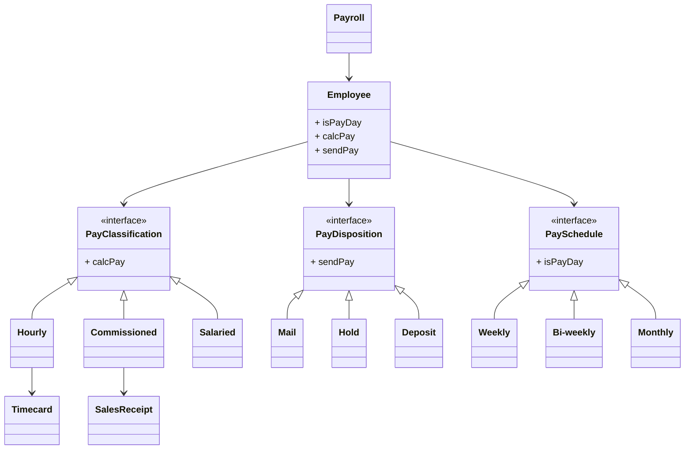

# 給与計算

## 概要

## 要件

- 従業員のデータベースがある。
- 給与計算プログラムは毎日実行され、その日に支払われるべき従業員の給与を計算する。
- 月給制の社員の給与は、その月の最終営業日に支払われる。月給は従業員のレコードのフィールドになっている。
- 歩合制の社員の給与は、隔週金曜日に支払われる。彼らの給与は基本給と歩合給である。基本給と歩合率は従業員レコードのフィールドになっている。歩合給は歩合率にその従業員の売上を掛けたものである。
- 時給制の社員の給与は、毎週金曜日に支払われる。時給は従業員レコードのフィールドになっている。給与は時給にタイムカードの勤務時間を掛けたものである。勤務時間が週40時間を超えた場合は、超過分の時給は1.5倍になる。
- 従業員は給与を自宅に送付するか、オフィスで給与計算者から受け取るか、銀行口座に入金するかを選択できる。自宅の住所、給与計算者、銀行口座の情報は従業員レコードのフィールドになっている。

## ドメインモデル

