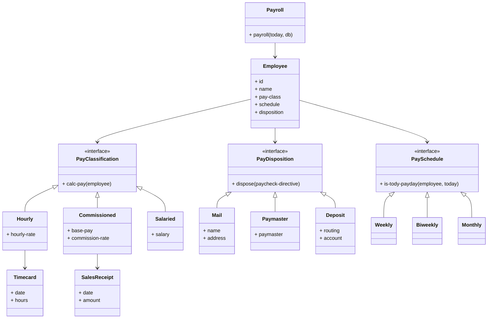
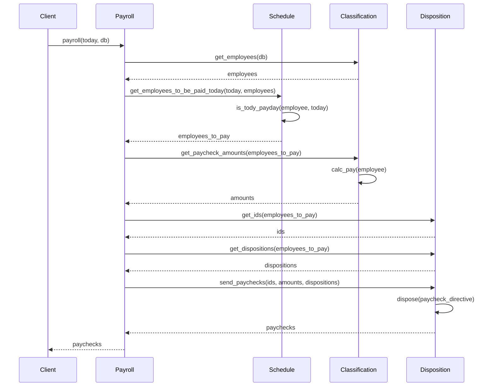

# 給与計算

## 概要

このプロジェクトは給与計算システムを実装しています。システムは従業員データベースを管理し、各従業員の給与タイプ（月給制、歩合制、時給制）に基づいて給与を計算し、指定された支払い方法（郵送、直接支払い、銀行振込）で給与を支払います。

システムは関数型プログラミングの原則に従って設計されており、明確な責任分離を持つモジュール構造になっています。マルチメソッドを使用して、異なる給与タイプや支払い方法に対して多態性を実現しています。

## 要件

- 従業員のデータベースがある。
- 給与計算プログラムは毎日実行され、その日に支払われるべき従業員の給与を計算する。
- 月給制の社員の給与は、その月の最終営業日に支払われる。月給は従業員のレコードのフィールドになっている。
- 歩合制の社員の給与は、隔週金曜日に支払われる。彼らの給与は基本給と歩合給である。基本給と歩合率は従業員レコードのフィールドになっている。歩合給は歩合率にその従業員の売上を掛けたものである。
- 時給制の社員の給与は、毎週金曜日に支払われる。時給は従業員レコードのフィールドになっている。給与は時給にタイムカードの勤務時間を掛けたものである。勤務時間が週40時間を超えた場合は、超過分の時給は1.5倍になる。
- 従業員は給与を自宅に送付するか、オフィスで給与計算者から受け取るか、銀行口座に入金するかを選択できる。自宅の住所、給与計算者、銀行口座の情報は従業員レコードのフィールドになっている。
 
## ドメインモデル



## 実装の詳細

このシステムはClojureで実装されており、関数型プログラミングのアプローチを採用しています。マルチメソッドを使用して多態性を実現し、データと振る舞いを分離しています。

システムは以下のモジュールで構成されています：

1. **interface.clj** - システムの主要なインターフェースを定義
   - `is-tody-payday` - 給与支払いスケジュールに基づいて、今日が給料日かどうかを判断するマルチメソッド
   - `calc-pay` - 給与クラスに基づいて給与を計算するマルチメソッド
   - `dispose` - 支払い方法に基づいて給与を支払うマルチメソッド

2. **classification.clj** - 給与クラスの実装
   - `:salaried` - 月給制の給与計算
   - `:hourly` - 時給制の給与計算（タイムカードに基づく）
   - `:commissioned` - 歩合制の給与計算（基本給＋売上×歩合率）

3. **disposition.clj** - 給与支払い方法の実装
   - `:mail` - 郵送による給与支払い
   - `:deposit` - 銀行振込による給与支払い
   - `:paymaster` - 給与担当者による直接支払い

4. **schedule.clj** - 給与支払いスケジュールの実装
   - `:monthly` - 月次給与（月の最終日）
   - `:weekly` - 週次給与（毎週金曜日）
   - `:biweekly` - 隔週給与（偶数週の金曜日）

5. **payroll.clj** - メインの給与計算処理
   - `payroll` - 指定された日付に基づいて給与計算を実行し、給与を支払う

## 処理フロー

以下のシーケンス図は、給与計算システムの主要な処理フローを示しています：



## データモデル

従業員データは以下の構造を持っています：

```clojure
{:id "emp123"                                ; 従業員ID
 :name "山田太郎"                            ; 従業員名
 :pay-class [:salaried 400000]               ; 給与クラス（月給制、月給40万円）
 :schedule :monthly                          ; 給与スケジュール（月次）
 :disposition [:deposit "0123" "45678901"]}  ; 支払い方法（銀行振込、銀行コード、口座番号）
```

給与クラスの例：
- `[:salaried 400000]` - 月給制、月給40万円
- `[:hourly 2000]` - 時給制、時給2000円
- `[:commissioned 200000 0.1]` - 歩合制、基本給20万円、歩合率10%

支払い方法の例：
- `[:mail "山田太郎" "東京都渋谷区..."]` - 郵送、名前、住所
- `[:deposit "0123" "45678901"]` - 銀行振込、銀行コード、口座番号
- `[:paymaster "給与担当者A"]` - 給与担当者による直接支払い

## 具体的な処理例

以下では、実際のデータを使用して給与計算システムの処理フローを具体的に説明します。

### データベース例

```clojure
{:employees [
  ;; 月給制の従業員
  {:id "emp001"
   :name "山田太郎"
   :pay-class [:salaried 400000]
   :schedule :monthly
   :disposition [:deposit "0123" "45678901"]}

  ;; 時給制の従業員
  {:id "emp002"
   :name "佐藤花子"
   :pay-class [:hourly 2000]
   :schedule :weekly
   :disposition [:mail "佐藤花子" "東京都新宿区..."]}

  ;; 歩合制の従業員
  {:id "emp003"
   :name "鈴木一郎"
   :pay-class [:commissioned 200000 0.1]
   :schedule :biweekly
   :disposition [:paymaster "給与担当者A"]}
 ]

 ;; 時間記録（タイムカード）
 :time-cards {
   "emp002" [["2023-06-01" 8]  ;; 6月1日：8時間
             ["2023-06-02" 7.5] ;; 6月2日：7.5時間
             ["2023-06-03" 9]   ;; 6月3日：9時間
             ["2023-06-04" 8]   ;; 6月4日：8時間
             ["2023-06-05" 8.5]] ;; 6月5日：8.5時間
 }

 ;; 売上記録
 :sales-receipts {
   "emp003" [["2023-06-01" 500000] ;; 6月1日：50万円
             ["2023-06-03" 300000] ;; 6月3日：30万円
             ["2023-06-05" 450000]] ;; 6月5日：45万円
 }
}
```

### 処理例1：月給制従業員（山田太郎）

1. **給料日の判定**：
   - 今日が6月30日（月の最終日）の場合
   - `is-tody-payday` は `:monthly` スケジュールに対して `true` を返す
   - 山田太郎は今日給料日と判定される

2. **給与計算**：
   - `calc-pay` は `:salaried` 給与クラスに対して実行される
   - 給与額 = 400,000円（月給）

3. **支払い処理**：
   - `dispose` は `:deposit` 支払い方法に対して実行される
   - 結果：
     ```clojure
     {:type :deposit
      :id "emp001"
      :routing "0123"
      :account "45678901"
      :amount 400000}
     ```

### 処理例2：時給制従業員（佐藤花子）

1. **給料日の判定**：
   - 今日が金曜日の場合
   - `is-tody-payday` は `:weekly` スケジュールに対して `true` を返す
   - 佐藤花子は今日給料日と判定される

2. **給与計算**：
   - `calc-pay` は `:hourly` 給与クラスに対して実行される
   - タイムカードから勤務時間を集計：8 + 7.5 + 9 + 8 + 8.5 = 41時間
   - 時給 = 2,000円
   - 給与額 = 2,000円 × 41時間 = 82,000円

3. **支払い処理**：
   - `dispose` は `:mail` 支払い方法に対して実行される
   - 結果：
     ```clojure
     {:type :mail
      :id "emp002"
      :name "佐藤花子"
      :address "東京都新宿区..."
      :amount 82000}
     ```

### 処理例3：歩合制従業員（鈴木一郎）

1. **給料日の判定**：
   - 今日が金曜日かつ偶数週の場合
   - `is-tody-payday` は `:biweekly` スケジュールに対して `true` を返す
   - 鈴木一郎は今日給料日と判定される

2. **給与計算**：
   - `calc-pay` は `:commissioned` 給与クラスに対して実行される
   - 売上記録から売上を集計：500,000 + 300,000 + 450,000 = 1,250,000円
   - 基本給 = 200,000円
   - 歩合率 = 0.1（10%）
   - 歩合給 = 1,250,000円 × 0.1 = 125,000円
   - 給与額 = 200,000円 + 125,000円 = 325,000円

3. **支払い処理**：
   - `dispose` は `:paymaster` 支払い方法に対して実行される
   - 結果：
     ```clojure
     {:type :paymaster
      :id "emp003"
      :paymaster "給与担当者A"
      :amount 325000}
     ```

