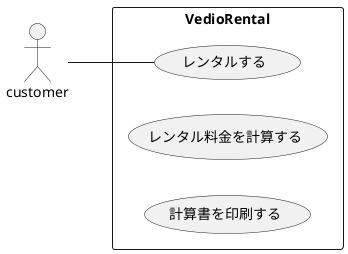
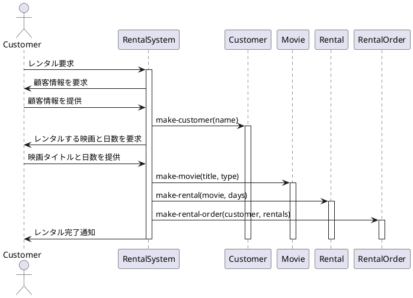
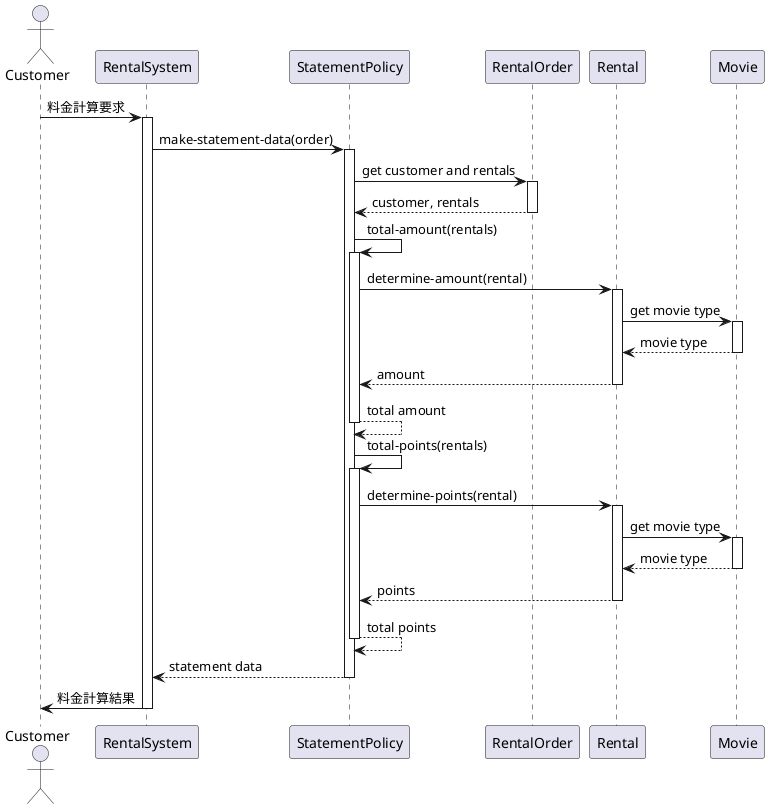
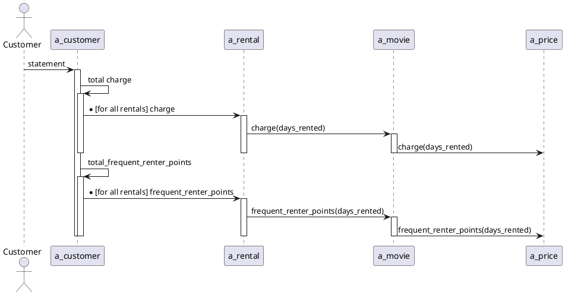
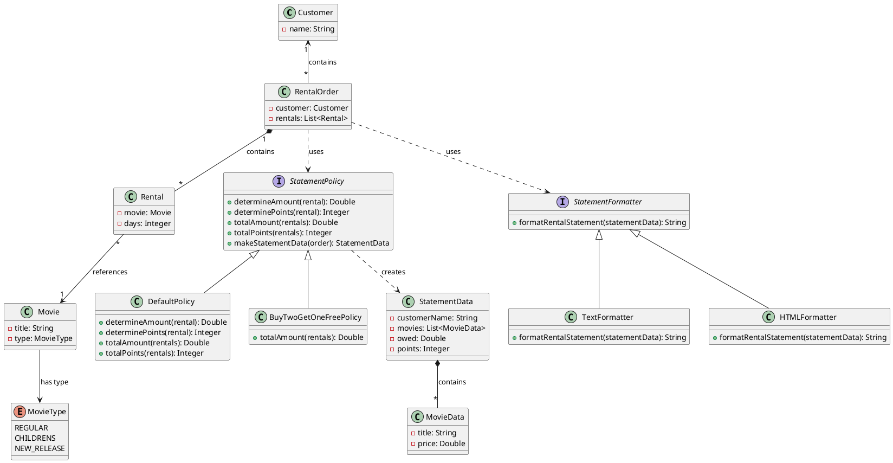

# レンタルビデオシステム

レンタルビデオシステムの最小限のClojure実装です。

## 基本仕様
+ ビデオレンタルの料金を計算して計算書を印刷するプログラム
+ システムにはどの映画を何日間借りるかが入力される。
+ 貸出の日数によって料金が計算され、映画の分類が判定される。
+ 映画の分類は３つある。一般向け、子供向け、新作。
+ レンタルポイントも印刷される。新作かどうかによってポイント計算の仕方が異なる。

## ユースケース


### ユースケース１：レンタルする


### ユースケース２：レンタル料金を計算する


### ユースケース３：計算書を印刷する


## ドメインモデル


## プロジェクト構造

```
rentalVideo/
├── deps.edn        # プロジェクト依存関係
├── src/            # ソースコード
│   └── video_store/
│       ├── buy_two_get_one_free_policy.clj  # 2つ買うと1つ無料のポリシー
│       ├── constructors.clj                 # コンストラクタ関数
│       ├── html_statement_formatter.clj     # HTML形式のフォーマッタ
│       ├── normal_statement_policy.clj      # 通常の料金ポリシー
│       ├── order_processing.clj             # 注文処理
│       ├── statement_formatter.clj          # 明細フォーマッタインターフェース
│       ├── statement_policy.clj             # 明細ポリシーインターフェース
│       └── text_statement_formatter.clj     # テキスト形式のフォーマッタ
└── spec/           # テスト
    └── video_store/
        ├── integration_specs.clj            # 統合テスト (speclj)
        ├── integration_test.clj             # 統合テスト (clojure.test)
        ├── statement_formatter_spec.clj     # フォーマッタテスト (speclj)
        ├── statement_formatter_test.clj     # フォーマッタテスト (clojure.test)
        ├── statement_policy_spec.clj        # ポリシーテスト (speclj)
        └── statement_policy_test.clj        # ポリシーテスト (clojure.test)
```

## 使用方法

### プロジェクトの実行

プロジェクトを実行するには、Clojure CLIを使用できます：

```bash
# REPLを起動
clj -M

# REPL内で
(require 'video_store.constructors)
(require 'video_store.statement_policy)
(require 'video_store.text_statement_formatter)
```

### テストの実行

```bash
clj -M:spec
```

## ライセンス

このプロジェクトは教育目的のみです。
