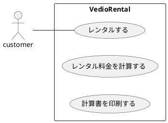
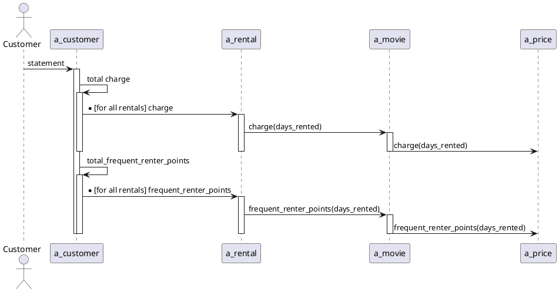
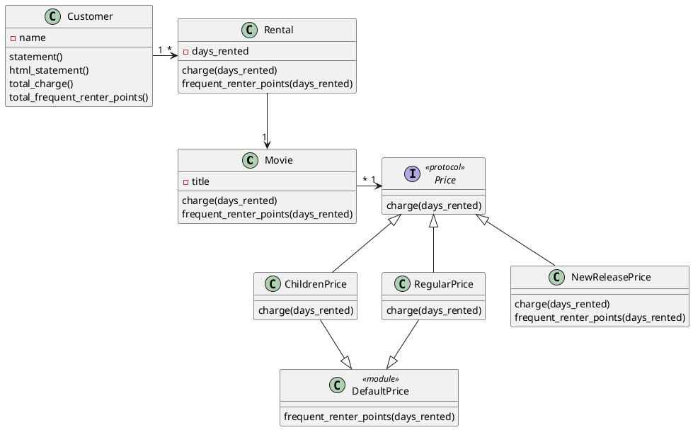

# レンタルビデオシステム

レンタルビデオシステムの最小限のClojure実装です。

## 基本仕様
+ ビデオレンタルの料金を計算して計算書を印刷するプログラム
+ システムにはどの映画を何日間借りるかが入力される。
+ 貸出の日数によって料金が計算され、映画の分類が判定される。
+ 映画の分類は３つある。一般向け、子供向け、新作。
+ レンタルポイントも印刷される。新作かどうかによってポイント計算の仕方が異なる。

## ユースケース


### ユースケース１：レンタルする

### ユースケース２：レンタル料金を計算する

### ユースケース３：計算書を印刷する


## コアモデル


## プロジェクト構造

```
rentalVideo/
├── deps.edn        # プロジェクト依存関係
├── src/            # ソースコード
│   └── rentalvideo/
│       └── rentalvideo.clj  # メイン実装
└── spec/           # テスト
    └── rentalvideo/
        ├── rentalvideo_spec.clj  # Specljテスト
        └── rentalvideo_test.clj  # clojure.testテスト
```

## 使用方法

### プロジェクトの実行

プロジェクトを実行するには、Clojure CLIを使用できます：

```bash
# REPLを起動
clj -M

# REPL内で
(require 'rentalvideo.rentalvideo)
```

### テストの実行

specljを使用してテストを実行するには：

```bash
clj -M:spec
```

clojure.testを使用してテストを実行するには：

```bash
clj -M:test
```

## ライセンス

このプロジェクトは教育目的のみです。
