# 業務分析

## ビジネスモデル

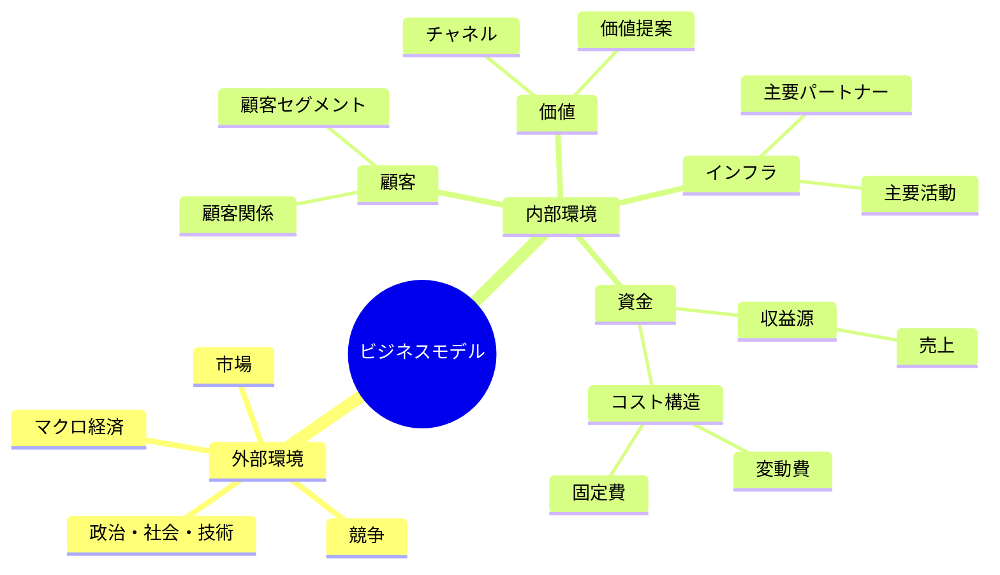

## インパクトマップ

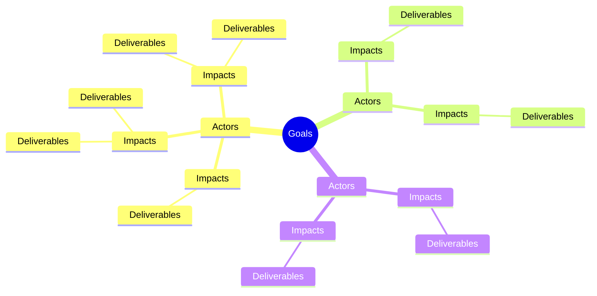

## ドメイン

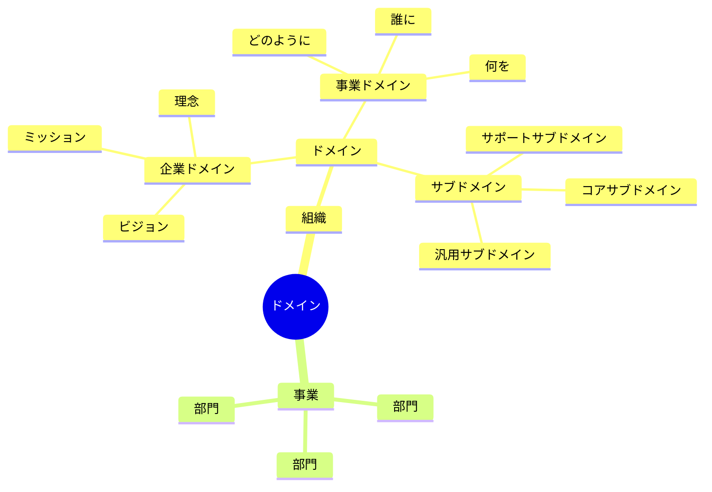

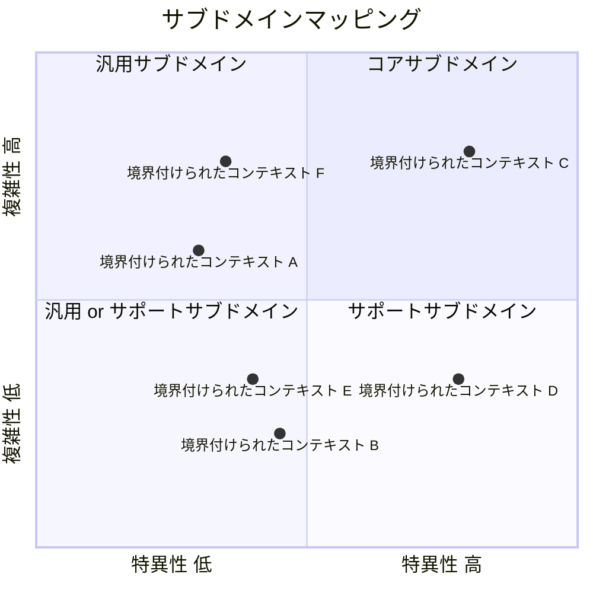

### 組織構造

### 企業ドメイン

### 事業ドメイン

### サブドメイン

#### コアサブドメイン

#### 汎用サブドメイン

#### サポートサブドメイン

## ビジネスコンテキスト

### サブドメイン

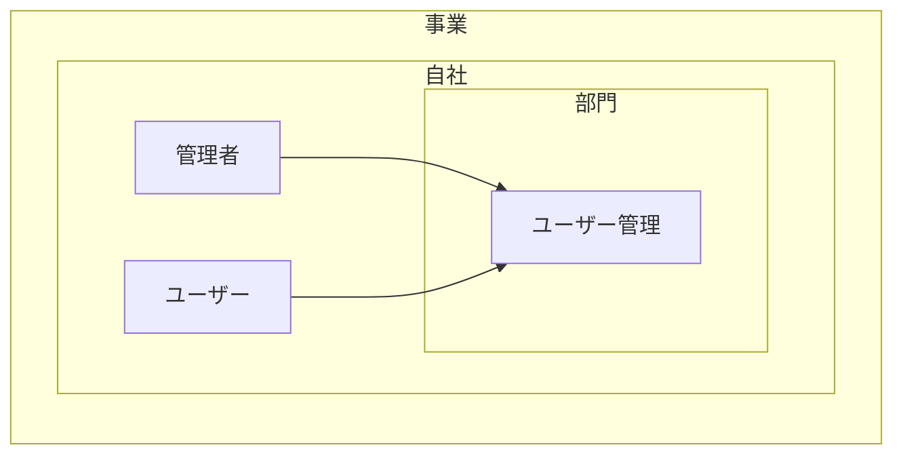

## ビジネスユースケース

### ユーザー管理

#### ユースケース図

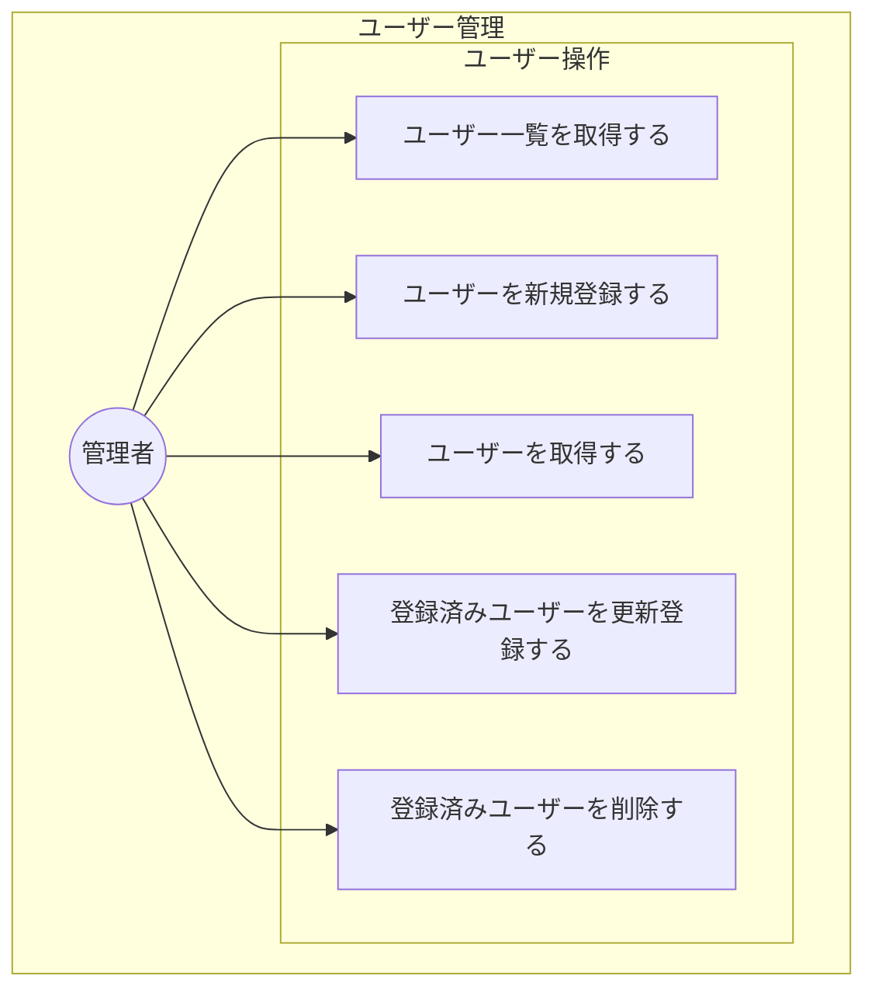

#### シーケンス図

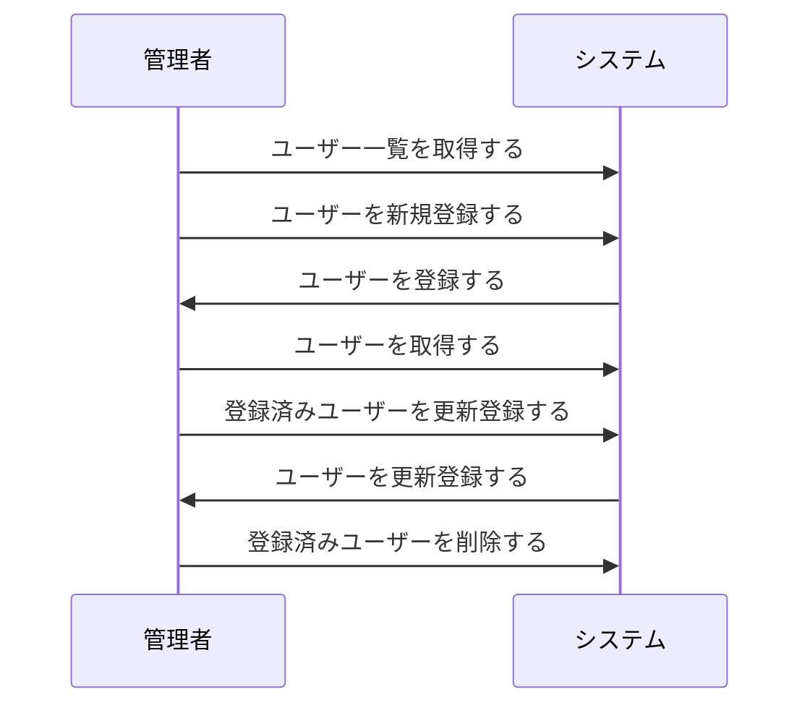

#### 業務フロー図

##### ユーザー一覧取得

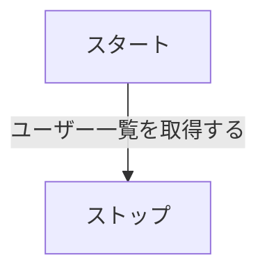

##### ユーザー新規登録

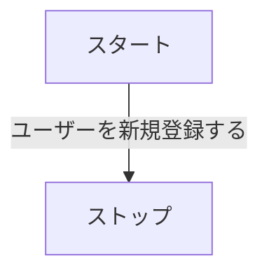

##### ユーザー取得

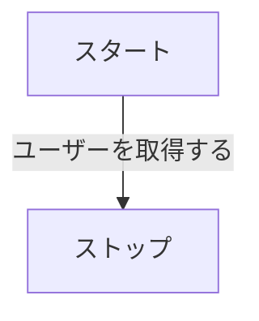

##### ユーザー更新登録

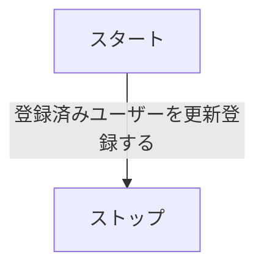

##### ユーザー削除

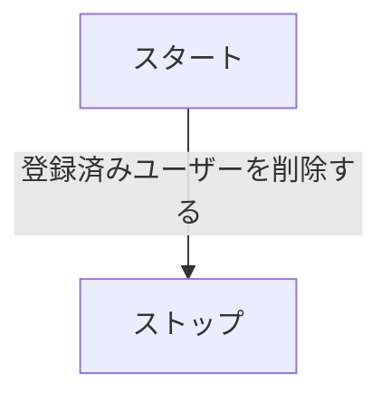
