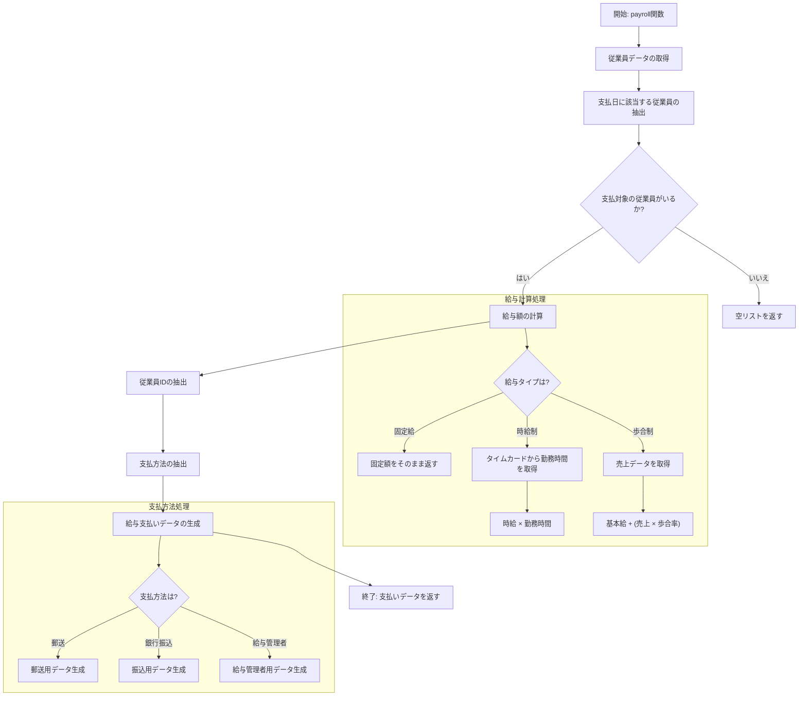
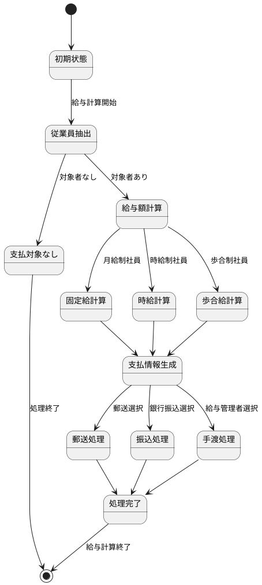

# 開発日誌

## 日付: 2025年6月2日

### 給与計算システムのコード分析

今日はClojureで実装された給与計算システムのコードをレビューしました。特に給与額の計算と支払方法の処理について詳細に調査しました。

#### 給与額の計算

給与計算システムは3つの異なる給与体系に対応しています：

1. **固定給（:salaried）**：
   ```clojure
   ;; 例：月給40万円の田中さん
   {:id 101, :pay-class [:salaried 400000]}
   ;; 計算結果: 400,000円
   ```

2. **時給制（:hourly）**：
   ```clojure
   ;; 例：時給2,000円で40時間勤務した鈴木さん
   {:id 102, :pay-class [:hourly 2000]}
   :time-cards {102 [["2022-11-15" 40]]}
   ;; 計算結果: 80,000円 (40時間 × 2,000円)
   ```

3. **歩合制（:commissioned）**：
   ```clojure
   ;; 例：基本給20万円、歩合率5%で300万円の売上を上げた佐藤さん
   {:id 103, :pay-class [:commissioned 200000 0.05]}
   :sales-receipts {103 [["2022-11-01" 3000000]]}
   ;; 計算結果: 350,000円 (200,000円 + 3,000,000円 × 0.05)
   ```

#### 支払方法の処理

支払方法は3種類あり、それぞれに必要なデータ構造が異なります：

1. **郵送（:mail）**：
   ```clojure
   ;; 入力データ
   [:mail "田中太郎" "東京都新宿区1-1-1"]
   ;; 生成される支払いデータ
   {:type :mail
    :id 101
    :name "田中太郎"
    :address "東京都新宿区1-1-1"
    :amount 400000}
   ```

2. **銀行振込（:deposit）**：
   ```clojure
   ;; 入力データ
   [:deposit "0123" "456789"]
   ;; 生成される支払いデータ
   {:type :deposit
    :id 102
    :routing "0123"  ;; 銀行コード/支店コード
    :account "456789" ;; 口座番号
    :amount 80000}
   ```

3. **給与管理者経由（:paymaster）**：
   ```clojure
   ;; 入力データ
   [:paymaster "山田部長"]
   ;; 生成される支払いデータ
   {:type :paymaster
    :id 103
    :paymaster "山田部長"
    :amount 350000}
   ```

#### 所感

Clojureの関数型プログラミングアプローチにより、給与計算の各ステップが明確に分離されており、コードの可読性と保守性が高くなっています。特に、データ変換の流れが明示的であり、デバッグや将来の拡張が容易になると思われます。

次回は、このシステムにタイムカードや売上データの入力機能を追加することを検討します。

#### 処理フロー

##### メインフローチャート（Mermaid）



##### 状態遷移図（PlantUML）



#### 今後の改善点

1. 日付による支払い対象の判定をより柔軟に行う
2. タイムカードや売上データの入力インターフェースの開発
3. 複数期間のデータ集計機能の追加
4. レポート生成機能の実装


