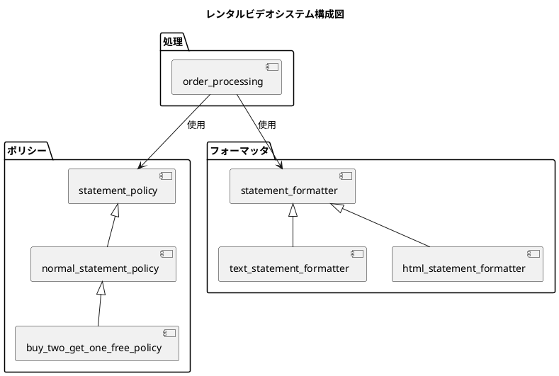
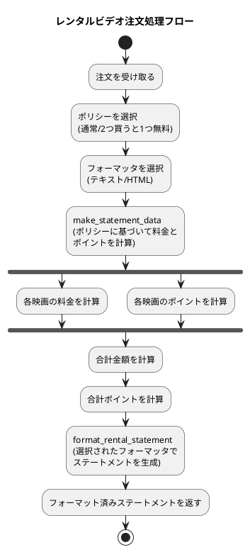
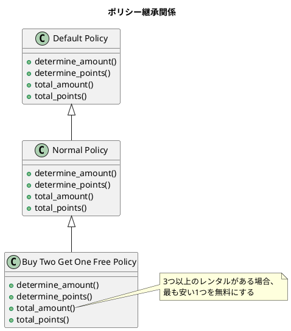

# 開発日誌

## 日付: 2025年06月17日

### レンタルビデオシステムの実装

今日はレンタルビデオシステムの実装を行いました。主にステートメント生成機能とフォーマッティング機能、および特別な料金ポリシーの実装に取り組みました。

#### 実装した機能

1. **ステートメントポリシー**:
   - 基本ポリシーの実装
   - 通常ポリシーの実装
   - 「2つ買うと1つ無料」ポリシーの実装

2. **ステートメントフォーマッタ**:
   - テキストフォーマッタの実装
   - HTMLフォーマッタの実装

3. **注文処理**:
   - ポリシーとフォーマッタを組み合わせた注文処理機能

4. **映画タイプごとの料金計算**:
   - 一般映画: 2日間は$2.0、それ以降は1日あたり$1.5
   - 子供向け映画: 3日間は$1.5、それ以降は1日あたり$1.5
   - 新作映画: 1日あたり$3.0

#### 実装コード

```clojure
;; ステートメントポリシーの基本実装
(defmulti determine-amount policy-movie-dispatch)
(defmulti determine-points policy-movie-dispatch)
(defmulti total-amount (fn [policy _rentals] (:type policy)))
(defmulti total-points (fn [policy _rentals] (:type policy)))

;; 一般映画の料金計算
(defmethod determine-amount [:default :regular] [_policy rental]
  (let [days (:days rental)]
    (if (> days 2)
      (+ 2.0 (* (- days 2) 1.5))
      2.0)))

;; 「2つ買うと1つ無料」ポリシーの合計金額計算
(defmethod total-amount
  ::buy-two-get-one-free
  [policy rentals]
  (let [amounts (map #(determine-amount policy %) rentals)]
       (if (> (count amounts) 2)
         (reduce + (drop 1 (sort amounts)))
         (reduce + amounts))))

;; テキストフォーマッタの実装
(defmethod format-rental-statement
  ::text
  [_formatter statement-data]
  (let [customer-name (:customer-name statement-data)
        movies (:movies statement-data)
        owed (:owed statement-data)
        points (:points statement-data)]
    (str
      (format "Rental Record for %s\n" customer-name)
      (apply str
             (for [movie movies]
               (format "\t%s\t%.1f\n"
                       (:title movie)
                       (:price movie))))
      (format "You owed %.1f\n" owed)
      (format "You earned %d frequent renter points\n" (int points)))))

;; 注文処理機能
(defn process-order [policy formatter order]
  (->> order
       (make-statement-data policy)
       (format-rental-statement formatter)))
```

#### システム構成図



#### 処理フロー



#### ポリシー継承関係



#### 次のステップ

1. 追加のポリシータイプの実装（季節限定割引など）
2. 追加のフォーマッタの実装（JSONやXMLなど）
3. 顧客ロイヤルティプログラムの拡張
4. 在庫管理機能の追加

#### 所感

今回の実装では、マルチメソッドを活用して柔軟なポリシーとフォーマッタの仕組みを構築しました。特に、ポリシーの継承関係を利用することで、コードの再利用性を高めることができました。「2つ買うと1つ無料」ポリシーは通常ポリシーを継承し、合計金額の計算部分だけをオーバーライドすることで、効率的に実装できました。

また、フォーマッタの実装では、同じデータ構造から異なる出力形式（テキストとHTML）を生成できるようにすることで、将来的な拡張性を確保しました。今後は、さらに多様なポリシーやフォーマッタを追加することで、システムの機能を拡張していきたいと考えています。