# アプリケーション開発ガイド

---

## 構成

- 導入部
- 環境設定
- アプリケーションの構造
- 開発ガイドライン
- ビルドとデプロイ
- テスト
- トラブルシューティング
- APIドキュメンテーション
- バージョン管理

---

## 導入部

アプリケーションの概要、目的、主な機能について説明します。

---

### 概要

アプリケーション開発において主要な活動を以下のように定義します。

要件では、アプリケーションの機能や性能、品質、セキュリティ、運用、保守などの要件をまとめる活動を行います。開発では要件を満たすための設計、実装、テストなどの活動を行います。運用では、アプリケーションの運用、保守、改善などの活動を行います。構築では、アプリケーションの環境設定を行います。配置では、アプリケーションのビルドとデプロイを行います。これらの活動は相互に影響し合い、連携して行われるため、それぞれの活動において、開発者が守るべき規則やガイドラインをまとめたドキュメントを参照してください。

---

### 目的

---

### 主な機能

---

## 環境設定

開発に必要なツールやソフトウエアのインストール方法、設定方法について説明します。

---

## アプリケーションの構造

アプリケーションの主要なコンポーネントやモジュール、それらの相互関係について説明します。

---

## 開発ガイドライン

コーディングスタイル、テスト戦略など、開発者が守るべき規則やガイドラインを説明します。

---

## ビルドとデプロイ

アプリケーションのビルド方法、デプロイ方法、パッケージング方法を説明します。

---

## テスト

ユニットテスト、統合テスト、システムテストなどのテスト戦略とテストケースの作成方法を説明します。

---

## トラブルシューティング

よくある問題とその解決策をリストアップします。

---

## APIドキュメンテーション

アプリケーションが提供するAPIの詳細なドキュメンテーションを提供します。

---

## バージョン管理

バージョン管理の戦略と、新しいバージョンをリリースする際の手順を説明します。

---

## 参照
